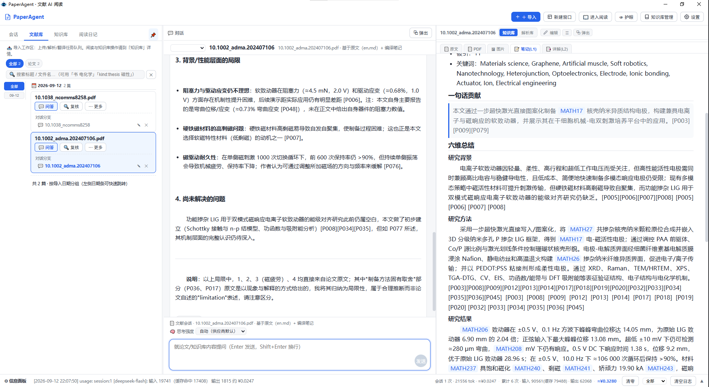
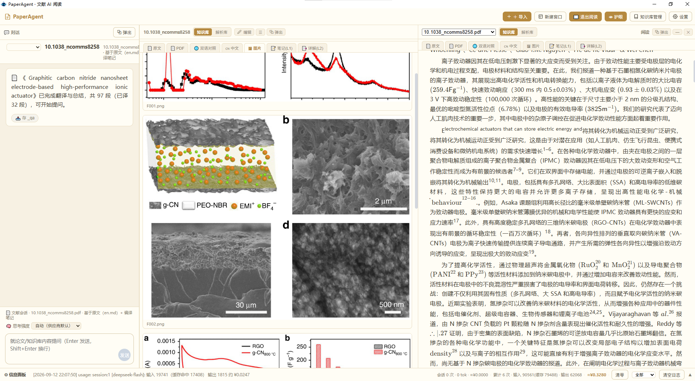

# PaperAgent 📄 Local AI workbench for papers (parsing · three-level knowledge compilation · translation · Q&A)

[](https://github.com/hui-xu-ai/PaperAgent/actions/workflows/ci.yml)
[](LICENSE)
[](pyproject.toml)
[](#environment-requirements)
[](#tests-and-verification)

> **In one line**: turn a pile of English PDFs into a **Chinese knowledge base you can read, search and ask questions against** —
> MinerU v4 precise parsing + dual-channel character arbitration (recognition review can be arbitrated by hand) → L1/L2/L3 three-level knowledge compilation →
> optional full-text translation/summary → multi-tab reading + FTS5 retrieval and Q&A. **One-click on Windows with no Python install required, and your data and keys stay on your machine.**
> Keywords: literature-review · paper-translation · knowledge-base · RAG · MinerU · a local alternative to Zotero

**Turn one English PDF into a Chinese knowledge base you can "read, search and ask questions against"**: a single-user, local-first AI reading / translation / knowledge-base app for papers.
Import → precise parsing (MinerU v4 + dual-channel character arbitration) → three-level knowledge compilation (L1/L2/L3 notes) → optional full-text translation → reading / retrieval / Q&A.

> ⚡ **Don't want to set up an environment?** Just download `PaperAgent-v1.0.0-win64.zip` from [Releases](https://github.com/hui-xu-ai/PaperAgent/releases) (about 86 MB, **no Python install needed**):
> unzip → double-click `PaperAgent.exe` → in Settings fill in `DEEPSEEK_API_KEY` (translation/compilation/Q&A) and `MINERU_API_KEY` (parsing) → start importing.
> To run from source, see "Installation" below.

A single-user, local-first **AI reading / translation / knowledge-base management** web app for papers: import PDF → precise parsing → compile knowledge-base notes (L1/L2/L3) → (optional) AI translation and summarization → read, search, ask questions.

## UI at a glance

**Overall UI**: left = sessions + paper library (type chips / search syntax sugar / attachment entry points), middle = reading and notes (compiled output is directly readable, and you can ask follow-up questions in place),
right = multi-tab reader for source / translation / images / notes; the status bar at the bottom shows live token usage and cache hits.



**Paper reading**: PDF source and Chinese translation side by side (images are extracted automatically and can be browsed separately), formulas and tables preserved; switch between Source / Bilingual / Chinese / Images / Notes (L1·L2·L3).



**Recognition review**: on the left is the source PDF (uncertain regions are boxed in red; page turning / zooming / middle-drag panning are supported), on the right is dual-channel difference arbitration —
for each difference you pick one of A/B/C/D, and **only the affected paragraph is changed**; once done, translation is automatically ready. When there are zero differences you can still browse the source directly.

| Difference arbitration | Zero differences (source still readable) |
|---|---|
|  |  |

The frontend is a **pure static single page** (no framework, no build step); the backend is FastAPI, and the algorithmic capability lives in two editable-install packages, `paperparse` / `paperkb`.

## What this is

| Capability | Description |
|---|---|
| Import | PDF (three modes), Markdown (official md, no re-parsing), Bib references (Web of Science export), **supporting information / review attachments** |
| Parsing | `paperparse.process_pdf_v2` (P14 text pipeline): local skeleton boundaries + MinerU full.md as the base + stitch repair + dual-channel verification + character arbitration |
| Compilation | `paperkb` three-level knowledge compilation: L1 one-sentence contribution + six dimensions + concept tags → L2 section highlights → L3 deep wiki / concept pages |
| Translation | Full-text translation + summary → `zh.md` / `en_zh.md` / `summary.md` (**optional, off by default**, costs tokens) |
| Reading | Multi-tab source / PDF / Chinese / English / images / notes, plus opening a new side-by-side reading window |
| Q&A | Conference-style sessions + SSE streaming; knowledge-base Q&A uses FTS5 recall (notes/meta/citation neighborhood/cards), never the full text in context |
| Retrieval | Paper library / knowledge base type-chip filters, `📎 attachments N` listing, search syntax sugar (`书 电化学`, `kind:thesis 磁性`) |
| Cost | Parsing consumes MinerU quota, compilation/translation/Q&A consume LLM quota — all metered (UsageService / TokenGuard); attachment import is **0 API cost** |

## Architecture

```
frontend/                     static single page (index.html + app.js + style.css; no build)
   ⇅ fetch /api/* + EventSource(SSE)
backend/app/                  FastAPI
  api/        12 route modules, all mounted under /api/*
  services/   container dependency injection: engine / task / kbmeta / chat / llm / settings / usage / event_bus
  plugins/    plugin registration (on_register)
packages/paperparse/          unified algorithm package: api.py facade + core/ + llm/ + middleware/ + assets (rules/templates/prompts)
packages/paperkb/             knowledge-base algorithm package: api.py facade + db(FTS5) / compile / translate / retrieve / imports / ...
```

Layering constraints: `paperparse` and `paperkb` **never import each other, and never import backend**; backend is the only caller, while scripts under `tools/` import `paperparse` directly. All paths are relative to `APP_DATA_DIR` (project root when not packaged) and never depend on the current working directory.

## Environment requirements

- Windows + **Python ≥ 3.12** (`requires-python` in `pyproject.toml`)
- A virtual environment `.venv` (not tracked by the repository)
- Network: parsing needs access to MinerU; translation/summarization/Q&A need access to an OpenAI-compatible LLM provider

## Installation

```powershell
# 1. Virtual environment (skip if .venv already exists)
python -m venv .venv

# 2. Backend dependencies (including dev: pytest/httpx/ruff)
.\.venv\Scripts\python.exe -m pip install -e ".[dev]"

# 3. The two algorithm packages (backend imports paperparse / paperkb directly, so editable installs are required)
.\.venv\Scripts\python.exe -m pip install -e packages\paperparse
.\.venv\Scripts\python.exe -m pip install -e packages\paperkb

# 4. Configure keys
Copy-Item .env.example .env   # then edit .env
```

## Configuration (`.env`, not committed, contains secrets — key names only)

| Key | Required | Purpose |
|---|---|---|
| `DEEPSEEK_API_KEY` | **Required** | Translation / summarization / compilation / Q&A |
| `DEEPSEEK_BASE_URL` / `DEEPSEEK_MODEL` | Optional | OpenAI-compatible endpoint and model |
| `LLM_TIMEOUT_SEC` / `LLM_MAX_RETRIES` | Optional | Per-call timeout and retries |
| `SILICONFLOW_API_KEY` / `SILICONFLOW_BASE_URL` / `SILICONFLOW_MODEL` | Optional | Fallback provider |
| `MINERU_API_KEY` | **Required (parsing fails without it)** | Main parsing channel, MinerU v4 precise. **Without a key the backend refuses to parse outright** (the free v1 channel and local pymupdf were withdrawn from the production chain in favor of "quality first", see `docs/COMPAT-REGISTER.md` C13); apply at <https://mineru.net/apiManage> |
| `MINERU_LANGUAGE` | Optional | `auto` (default, decides Chinese/English from the first page's character set) / `en` / `ch` |
| `MINERU_IS_OCR` | Optional | `auto` (default; enabled automatically when there is no text layer) / `on` / `off` (must be on for scans) |
| `MINERU_ENABLE_TABLE` / `MINERU_ENABLE_FORMULA` | Optional | Table / formula recognition, on by default |
| `MINERU_BASE_URL` / `MINERU_MODEL_VERSION` | Optional | Parsing endpoint and model (default `vlm`) |
| `PADDLEOCR_ACCESS_TOKEN` / `PADDLEOCR_BASE_URL` / `PADDLEOCR_MODEL_VERSION` | Optional | Secondary channel (takes part in dual-channel character arbitration) |
| `PADDLEOCR_OPTIONS` | Optional | JSON, default `{"restructurePages":true,"mergeTables":true,"relevelTitles":true}` (cross-page tables / heading leveling) |
| `PAPER_FULLTEXT_PREFIX_CHARS` | Optional | Character cap for the full-text prefix in paper sessions: **`-1` (default) means no truncation** (byte-for-byte identical to the compilation/translation prefix ⇒ the prefix cache can be shared); `0` disables the mechanism; `>0` truncates |
| `PAPERAGENT_HOST` / `PAPERAGENT_PORT` | Optional | Defaults `127.0.0.1` / `8900` |
| `PAPERAGENT_DB` | Optional | System database path, default `data/system/app.db` (**five isolated databases** under `data/{system,chat,diary,biblio,reference}/`, see `docs/DATA-LAYOUT.md`) |
| `ENGINE_WORK_ROOT` / `ENGINE_OUT_ROOT` / `ENGINE_INPUT_ROOT` | Optional | Canonical library root / export staging / import staging (all under `APP_DATA_DIR`) |
| `CHAT_HISTORY_LIMIT` / `ANSWER_CACHE_SIZE` / `QUERY_LIMIT_CHARS` | Optional | Conversation and retrieval budgets |

**Reasoning effort** (the `reasoning_effort` used for L1/L2/L3 compilation and translation) is not set in `.env` but in **Settings → Knowledge base → Compilation / Translation policy**:
`auto` (default) / `none` / `minimal` / `low` / `medium` / `high`. "Auto" = **the parameter is not sent to the server at all** (the server decides by its own default policy, matching historical behavior); reasoning tokens count as output and are billed at the output price, so lowering the level saves money but may hurt quality (terminology consistency / six-dimension completeness / paragraph citations).

Other tunables (parsing pipeline `PARSE_MODE` / `PARSE_AI_REVIEW` / `PAPERPARSE_PIPELINE`, history budgets `HISTORY_TOKEN_BUDGET` / `HISTORY_MAX_MESSAGES`, rules root `RULES_DIR`, tool rounds `MANAGE_TOOLS_MAX_ROUNDS`) are documented in `backend/app/config.py`. At startup the app self-checks keys that "were given a value but failed to load" (BOM/line-ending corruption) and warns about them.

## Running

```powershell
# Option 1: one-click script (without .env it first generates one from .env.example and exits)
.\start.ps1

# Option 2: manual
cd backend
& '..\.venv\Scripts\python.exe' -m app.main
```

Then open **http://127.0.0.1:8900** in your browser (no window is opened automatically any more). Health check:

```powershell
Invoke-RestMethod http://127.0.0.1:8900/api/health
# returns status / version / engine_ready / deepseek_configured / mineru_parser / llm_ready
```

One-click shutdown: `.\stop.bat` (finds the PID by port 8900, with a fallback match on the `python -m app.main` command line).

## Typical workflow

1. **Import PDFs**: "＋ Import" in the top bar → `📄 PDF` tab, pick a mode and import in batches.
   - **Parse + compile (default)**: parse → add to the knowledge base → compile L1, **skipping translation (saves tokens)**
   - **Full pipeline**: plus translation + summary (costs tokens)
   - **Parse only**: not added to the knowledge base, no compilation, no translation, **0 tokens**
2. **Parsing (mandatory)**: the paper library on the left shows task progress (SSE); when it finishes the artifacts land in `library/<RID>/`.
3. **Compilation (optional, further step)**: queue and process jobs via "⚙ Compilation manager" on the knowledge-base side; L1 = L1 notes, L2/L3 are done selectively by value (L1 covers everything, L2/L3 the best candidates). With `auto_compile` enabled, L1 is queued automatically and consumed by a background thread.
4. **Translation (optional, off by default)**: import in full-pipeline mode, or start translation for a single paper from its card in the paper library.
5. **Supporting information / review comments**: "＋ Import" → `📎 Supporting info · review comments` tab, choose the parent resource + kind (SI / review comments / data / notes). This goes through the **lightweight pipeline** (purely local text extraction, **0 API cost**), lands in `library/<parent resource>/attachments/<kind>/`, and the text enters the retrieval index so Q&A can recall it.
6. **Reading and Q&A**: in the knowledge-base detail view switch between source / English / Chinese / images / notes; questions get streamed answers that can be written back as QA cards.

## Directory structure

```
backend/            FastAPI backend source + tests/ + engine_assets/ (packaging snapshot)
frontend/           static frontend page (index.html / app.js / style.css / vendor/)
packages/paperparse/  unified algorithm package (api.py facade + core/ parsing chain + llm/ + middleware/ + assets)
packages/paperkb/     knowledge-base algorithm package (db/compile/translate/retrieve/imports/attachments/cards/diary)
tools/              ops and diagnostics scripts (batch parsing, scorecard, CDP probing, migration, ...)
assets/             icon.ico and other static assets
rules/              external rules root (builtin rules live in the package; learned/user are writable)
docs/ feedback/     design and session records (documents, not runtime)
library/            [generated] parsing library: library/<RID>/ = mineru_full.md / en.md / document.json / images / work / qa_report.json
                    + library/<RID>/attachments/{si,review,data}/ (dependent material, lives and dies with its parent resource)
knowledge_base/     [generated] knowledge base: <DOI dir>/ = en.md / zh.md / en_zh.md / summary.md / source.pdf / notes + _qa/
                    + .system/ (SQLite: paperagent.db etc., do not delete by hand)
input/              [deprecated] import staging moved to `work/upload/` (work is a disposable area)
work/               [generated · disposable] temporary/intermediate artifacts (import staging upload/, dual-channel intermediates dual/, pytest temp dirs)
release/ dist/      [generated] distribution zips and PyInstaller output (not committed)
用户提供的文献/      [input] the user's original material (read-only, not committed)
.dsh-memory/        session memory (separate git, not committed with the code)
```

`library/`, `knowledge_base/`, `work/`, `data/`, `release/`, `dist/` and `.env` are all git-ignored; **before cleaning anything, make sure you are not touching `attachments/` or the knowledge base's `.system/`**.

## Tests and verification

```powershell
.\.venv\Scripts\python.exe -m pytest backend/tests packages/paperkb/tests packages/paperparse/tests -q --basetemp=work\pytest-tmp-x
```

- Current baseline: **1012 passed / 0 failed / 3 skipped** (measured 2026-09-12; `skipped` = cases missing real samples)
- Tests mostly depend on a mock LLM and **do not go online**; `--basetemp` points at `work/` for uniform cleanup
- `tmp_work` in `packages/paperparse/tests/conftest.py` now cleans up right after use; if a test run is interrupted, `packages/paperparse/work/pytest-tmp2` may be left behind and can simply be deleted
- Before a release also run the gate: `& '.venv\Scripts\python.exe' tools\release_check.py --full` (version consistency / data compatibility / packaging self-check / documentation completeness)

## FAQ

| Symptom | Cause / handling |
|---|---|
| The backend disappears after closing the window or refreshing | `auto_exit` in Settings **must stay false**; only when it is enabled does `/api/system/shutdown` actually stop the server (default off = the request is ignored). Shutdown is now **graceful**: stop accepting new requests → wait for in-flight requests and tasks to wrap up → process exits, with a 15s hard-exit fallback |
| Frontend changes don't take effect | For frontend static assets a **page refresh is enough** (static responses carry `Cache-Control: no-cache`, so the same URL is revalidated with a 304); large third-party files under `/vendor/` still use normal caching |
| Backend changes don't take effect | Python backend changes **require a process restart** (`reload=False`); there is no hot reload |
| The page opens but the data is empty | Table creation/migration sits in `KbMetaService`'s **lazy initialization**: hitting `/api/health` alone does not trigger it — you need one call to `/api/kb-meta/*` (for example opening the knowledge-base list) |
| Translation/compilation reports LLM not configured | `DEEPSEEK_API_KEY` is missing from `.env`, or was swallowed by commenting/line-ending corruption (the startup log warns about this explicitly) |
| Parsing is very slow or fails | Without `MINERU_API_KEY` parsing is **refused outright** (the free v1 channel and local PyMuPDF were withdrawn from the production chain in favor of "quality first", see `docs/COMPAT-REGISTER.md` C13); with a key, timeouts/rate limits show the original error text on the paper card |
| `engine_ready: false` | `paperparse` isn't installed properly: run `pip install -e packages\paperparse` again |
| Disk filled up by `work/` | `work/` is a disposable intermediate-artifact directory (including dual-channel caches); delete it directly after stopping the server |
| Afraid of losing data when closing a tab | Attachments (SI/review comments) are already in the retrieval index; before cleaning any directory, confirm it holds no `attachments/` and no `.system/` |

## Packaging (PyInstaller)

```powershell
.\.venv\Scripts\python.exe -m pip install pyinstaller
.\.venv\Scripts\pyinstaller.exe PaperAgent.spec --noconfirm
# output: dist\PaperAgent\PaperAgent.exe
```

- The spec uses **its own directory** as the project root (**no hard-coded drive letter or user name**), so it can be packaged directly on another machine or path; running it from a different directory fails with an explicit `assert`
- The entry point is `backend/launcher.py`; the static frontend page and `packages/paperparse`'s `rules/templates/prompts/tools/memory` are bundled into `_MEIPASS` (read-only resources)
- Writable data (`.env`, SQLite, `library/`, `knowledge_base/`, `work/`, `rules/`) lives **next to the exe**; copy `.env` there before the first run
- The packaged build has a system tray (open the web page / exit); drop an `icon.ico` next to the exe to replace the icon

## Known limitations

- Single-user local app (listens only on 127.0.0.1 by default, **no authentication** — do not expose it to the public internet)
- Parsing depends on the MinerU network (no key means no parsing); translation/compilation/Q&A depend on an OpenAI-compatible LLM
- Translation paragraph coverage is up to engine behavior (heading/formula paragraphs may be skipped)
- Dual-channel arbitration (`PARSE_AI_REVIEW=1`) is billed per call and can be turned off in settings
- Distribution packaging is Windows-only (the source runs on Linux/macOS, but that is not verified)

## Privacy and keys

- API keys live only in **your machine's `.env`** (packaged build = next to the exe) and in the local SQLite settings table; they are **never uploaded to any third party**.
  All network requests go only to the `DEEPSEEK_BASE_URL` / `MINERU_BASE_URL` you configure yourself.
- Papers, parsing artifacts and the knowledge base all stay in local directories (`library/`, `knowledge_base/`), which the repository's `.gitignore` excludes,
  so **contributing code never carries your paper data** (see `CONTRIBUTING.md`).

## License

[MIT](LICENSE). Third-party dependencies keep their own licenses (PyMuPDF is AGPL/commercial dual-licensed — check compliance yourself if you intend to **distribute a closed-source derivative**).
The list of Python dependencies bundled in the packaged build is in `dist/PaperAgent/_internal/`; the build is defined by `PaperAgent.spec`.

## Contributing

- Report bugs / request features: [Issues](https://github.com/hui-xu-ai/PaperAgent/issues) (the template will guide you to include the version and logs)
- Read `CONTRIBUTING.md` before changing code (it covers the merge gate and verification-level requirements)
