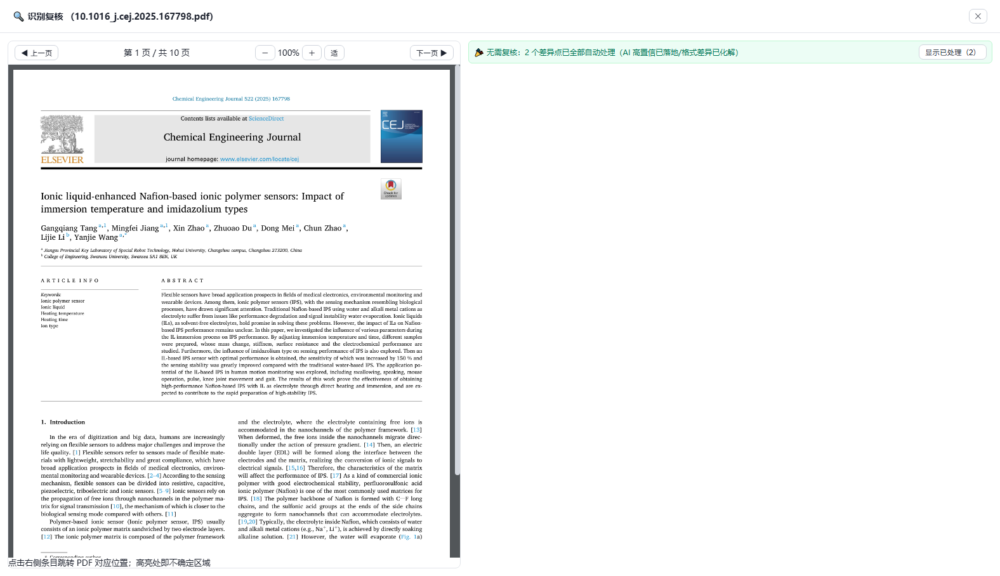
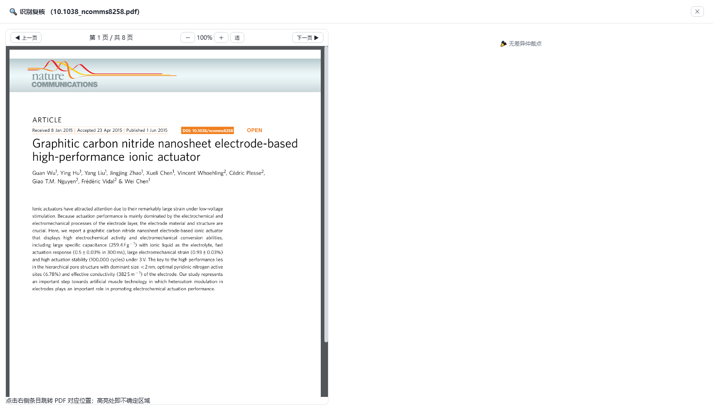

# PaperAgent 📄

[](LICENSE)
[](pyproject.toml)
[](#环境要求)
[](#测试与验证)

**把一篇英文 PDF 变成"能读、能查、能问"的中文知识库**：本机单用户的文献 AI 阅读 / 翻译 / 知识库应用。
导入 → 精准解析（MinerU v4 + 双通道字符仲裁）→ 三级知识编译（L1/L2/L3 笔记）→ 可选全文翻译 → 阅读 / 检索 / 问答。

> ⚡ **不想折腾环境？** 直接下载 [Releases](../../releases) 里的 `PaperAgent-v1.0.0-win64.zip`（约 86MB，**免装 Python**）：
> 解压 → 双击 `PaperAgent.exe` → 在「设置」里填 `DEEPSEEK_API_KEY`（翻译/编译/问答）与 `MINERU_API_KEY`（解析）→ 开始导入。
> 源码运行见下方「安装」。

本机单用户的**文献 AI 阅读 / 翻译 / 知识库管理** Web 应用：导入 PDF → 精准解析 → 编译知识库笔记（L1/L2/L3）→（可选）AI 翻译与总结 → 阅读、检索、问答。

## 界面速览

**识别复核**：左侧是原文 PDF（红框标出不确定区域，可翻页/缩放/中键拖拽），右侧是双通道差异点仲裁——
每个差异点给 A/B/C/D 四选一，**只影响对应段落**，处理完自动就绪翻译；零差异项时也能直接翻阅原文。

| 差异点仲裁 | 零差异项（仍可读原文） |
|---|---|
|  |  |

前端是一个**纯静态单页**（无框架、无构建步骤），后端是 FastAPI，算法能力收在两个可编辑安装的包 `paperparse` / `paperkb` 里。

## 这是什么

| 能力 | 说明 |
|---|---|
| 导入 | PDF（三种模式）、Markdown（官方 md，免重新解析）、Bib 引用（WOS 导出）、**支撑信息/审稿意见附件** |
| 解析 | `paperparse.process_pdf_v2`（P14 文本管线）：本地骨架边界 + MinerU full.md 基底 + 拼接修复 + 双通道验证 + 字符仲裁 |
| 编译 | `paperkb` 三级知识编译：L1 一句话贡献+六维+概念标签 → L2 章节要点 → L3 深度 wiki / 概念页 |
| 翻译 | 全文翻译 + 总结 → `zh.md` / `en_zh.md` / `summary.md`（**可选，默认关**，耗 token） |
| 阅读 | 原文 / PDF / 中文 / 英文 / 图片 / 笔记多标签，支持新建对比阅读窗口 |
| 问答 | 会议式会话 + SSE 流式；知识库问答走 FTS5 召回（notes/meta/引用邻域/卡片），非全文进上下文 |
| 检索 | 文献库/知识库类型芯片筛选、`📎 附件 N` 清单、搜索语法糖（`书 电化学`、`kind:thesis 磁性`） |
| 成本 | 解析扣 MinerU 配额、编译/翻译/问答扣 LLM 配额，全部记账（UsageService / TokenGuard）；附件导入 **0 API 成本** |

## 架构

```
frontend/                     静态单页（index.html + app.js + style.css；无构建）
   ⇅ fetch /api/* + EventSource(SSE)
backend/app/                  FastAPI
  api/        12 个路由模块，全部挂在 /api/*
  services/   container 依赖注入：engine / task / kbmeta / chat / llm / settings / usage / event_bus
  plugins/    插件注册（on_register）
packages/paperparse/          统一算法包：api.py 门面 + core/ + llm/ + middleware/ + assets(规则/模板/提示词)
packages/paperkb/             知识库算法包：api.py 门面 + db(FTS5) / compile / translate / retrieve / imports / ...
```

分层约束：`paperparse` 与 `paperkb` **互不 import、也不 import backend**；backend 是唯一调用方，`tools/` 脚本直接 import `paperparse`。路径一律相对 `APP_DATA_DIR`（非打包 = 项目根），不依赖当前工作目录。

## 环境要求

- Windows + **Python ≥ 3.12**（`pyproject.toml` 的 `requires-python`）
- 虚拟环境 `.venv`（仓库不跟踪）
- 网络：解析需访问 MinerU；翻译/总结/问答需访问 OpenAI 兼容 LLM 供应商

## 安装

```powershell
# 1. 虚拟环境（已有 .venv 可跳过）
python -m venv .venv

# 2. 后端依赖（含 dev：pytest/httpx/ruff）
.\.venv\Scripts\python.exe -m pip install -e ".[dev]"

# 3. 两个算法包（backend 直接 import paperparse / paperkb，必须可编辑安装）
.\.venv\Scripts\python.exe -m pip install -e packages\paperparse
.\.venv\Scripts\python.exe -m pip install -e packages\paperkb

# 4. 配置密钥
Copy-Item .env.example .env   # 然后编辑 .env
```

## 配置（`.env`，不入库、含密钥，只列键名）

| 键 | 必填性 | 用途 |
|---|---|---|
| `DEEPSEEK_API_KEY` | **必填** | 翻译 / 总结 / 编译 / 问答 |
| `DEEPSEEK_BASE_URL` / `DEEPSEEK_MODEL` | 可选 | OpenAI 兼容端点与模型 |
| `LLM_TIMEOUT_SEC` / `LLM_MAX_RETRIES` | 可选 | 单次调用超时与重试 |
| `SILICONFLOW_API_KEY` / `SILICONFLOW_BASE_URL` / `SILICONFLOW_MODEL` | 可选 | 备用供应商 |
| `MINERU_API_KEY` | **必填（否则无法解析）** | 解析主通道 MinerU v4 精准。**没有 Key 时后端直接拒绝解析**（免费 v1 通道与本地 pymupdf 已按"质量优先"撤出生产链，见 `docs/COMPAT-REGISTER.md` C13）；申请 <https://mineru.net/apiManage> |
| `MINERU_LANGUAGE` | 可选 | `auto`（默认，按首页字符集判定中/英）/ `en` / `ch` |
| `MINERU_IS_OCR` | 可选 | `auto`（默认，无文本层→自动开）/ `on` / `off`（扫描件必开） |
| `MINERU_ENABLE_TABLE` / `MINERU_ENABLE_FORMULA` | 可选 | 表格 / 公式识别，默认开 |
| `MINERU_BASE_URL` / `MINERU_MODEL_VERSION` | 可选 | 解析端点与模型（默认 `vlm`） |
| `PADDLEOCR_ACCESS_TOKEN` / `PADDLEOCR_BASE_URL` / `PADDLEOCR_MODEL_VERSION` | 可选 | 辅通道（参与双通道字符仲裁） |
| `PADDLEOCR_OPTIONS` | 可选 | JSON，默认 `{"restructurePages":true,"mergeTables":true,"relevelTitles":true}`（跨页表格 / 标题分级） |
| `PAPER_FULLTEXT_PREFIX_CHARS` | 可选 | 文献会话全文前缀的字符上限：**`-1`（默认）不截断**（与编译/翻译前缀逐字节一致 ⇒ 前缀缓存可共享）；`0` 关闭该机制；`>0` 截断 |
| `PAPERAGENT_HOST` / `PAPERAGENT_PORT` | 可选 | 默认 `127.0.0.1` / `8900` |
| `PAPERAGENT_DB` | 可选 | 系统库路径，默认 `data/system/app.db`（**五库隔离** `data/{system,chat,diary,biblio,reference}/`，见 `docs/DATA-LAYOUT.md`） |
| `ENGINE_WORK_ROOT` / `ENGINE_OUT_ROOT` / `ENGINE_INPUT_ROOT` | 可选 | 规范库根 / 导出暂存 / 导入暂存（均在 `APP_DATA_DIR` 下） |
| `CHAT_HISTORY_LIMIT` / `ANSWER_CACHE_SIZE` / `QUERY_LIMIT_CHARS` | 可选 | 对话与检索预算 |

**思考档位**（编译 L1/L2/L3 与翻译的 `reasoning_effort`）不在 `.env`，而在**设置中心 → 知识库 → 编译 / 翻译策略**：
`自动`（默认）/ `none` / `minimal` / `low` / `medium` / `high`。「自动」= **不向服务端发送该参数**（由服务端
按其默认策略决定，与历史行为一致）；思考 token 计入输出并按输出价计费，下调可省钱但可能影响质量（术语一致性 /
六维完整性 / 段落引用）。

其它可调项（解析管线 `PARSE_MODE` / `PARSE_AI_REVIEW` / `PAPERPARSE_PIPELINE`、历史预算 `HISTORY_TOKEN_BUDGET` / `HISTORY_MAX_MESSAGES`、规则根 `RULES_DIR`、工具轮次 `MANAGE_TOOLS_MAX_ROUNDS`）见 `backend/app/config.py`。启动时会自检「写了值却没加载成功」的 key（BOM/换行损坏）并报警。

## 启动

```powershell
# 方式一：一键脚本（无 .env 会先从 .env.example 生成并退出）
.\start.ps1

# 方式二：手动
cd backend
& '..\.venv\Scripts\python.exe' -m app.main
```

然后浏览器打开 **http://127.0.0.1:8900**（不再自动开窗）。健康检查：

```powershell
Invoke-RestMethod http://127.0.0.1:8900/api/health
# 返回 status / version / engine_ready / deepseek_configured / mineru_parser / llm_ready
```

一键关停：`.\stop.bat`（按端口 8900 找 PID，兜底按 `python -m app.main` 命令行匹配）。

## 典型使用流程

1. **导入 PDF**：顶栏「＋ 导入」→ `📄 PDF` 标签，选模式后批量导入。
   - **解析 + 编译（默认）**：解析 → 纳入知识库 → 编译 L1，**跳过翻译（省 token）**
   - **全流水线**：再加翻译 + 总结（耗 token）
   - **仅解析**：不纳库、不编译、不翻译，**0 token**
2. **解析（必做）**：左侧文献库显示任务进度（SSE），完成后产物落在 `library/<RID>/`。
3. **编译（进一步，可选）**：知识库侧「⚙ 编译管理」入队并处理；L1=L1 笔记，L2 / L3 按价值分（L1 全覆盖，L2/L3 择优选做）。开启 `auto_compile` 后 L1 自动入队，由后台线程消费。
4. **翻译（可选，默认关）**：全流水线模式导入，或在文献卡片上对单篇启动翻译。
5. **支撑信息 / 审稿意见**：「＋ 导入」→ `📎 支撑信息·审稿意见` 标签，选父资源 + 类型（SI / 审稿意见 / 数据 / 笔记）。走**轻量管线**（纯本地抽文本，**0 API 成本**），落 `library/<父资源>/attachments/<kind>/`，文本进检索索引可被问答召回。
6. **阅读与问答**：知识库详情里切换原文 / 英文 / 中文 / 图片 / 笔记；提问走流式回答，可回写为 QA 卡片。

## 目录结构

```
backend/            FastAPI 后端源码 + tests/ + engine_assets/（打包快照）
frontend/           前端静态页（index.html / app.js / style.css / vendor/）
packages/paperparse/  统一算法包（api.py 门面 + core/ 解析链 + llm/ + middleware/ + assets）
packages/paperkb/     知识库算法包（db/compile/translate/retrieve/imports/attachments/cards/diary）
tools/              运维与诊断脚本（解析批跑、评分卡、CDP 实测、迁移等）
assets/             icon.ico 等静态资产
rules/              外部规则根（builtin 在包内；learned/user 可写）
docs/ feedback/     设计与会话记录（文档，非运行时）
library/            【生成物】解析库：library/<RID>/ = mineru_full.md / en.md / document.json / images / work / qa_report.json
                    + library/<RID>/attachments/{si,review,data}/（依附资料，与父资源同生共死）
knowledge_base/     【生成物】知识库：<DOI 目录>/ = en.md / zh.md / en_zh.md / summary.md / source.pdf / 笔记 + _qa/
                    + .system/（SQLite：paperagent.db 等，勿手删）
input/              【已废弃】导入暂存迁到 `work/upload/`（work 是可清理区）
work/               【生成物·可清理】临时/中间产物（导入暂存 upload/、双通道中间产物 dual/、pytest 临时目录）
release/ dist/      【生成物】分发版 zip 与 PyInstaller 产物（不入库）
用户提供的文献/      【输入】用户原始资料（只读使用，不入库）
.dsh-memory/        会话记忆（独立 git，不随代码提交）
```

`library/`、`knowledge_base/`、`work/`、`data/`、`release/`、`dist/`、`.env` 均已 git 忽略；**清理前务必确认不动 `attachments/` 与知识库 `.system/`**。

## 测试与验证

```powershell
.\.venv\Scripts\python.exe -m pytest backend/tests packages/paperkb/tests packages/paperparse/tests -q --basetemp=work\pytest-tmp-x
```

- 当前基线：**1012 passed / 0 failed / 3 skipped**（2026-09-12 实测；`skipped` = 缺真实样本的用例）
- 主要依赖 mock LLM，**不联网**；`--basetemp` 指向 `work/` 以便统一清理
- `packages/paperparse/tests/conftest.py` 的 `tmp_work` 改为「用完即清」；测试被中断时可能残留 `packages/paperparse/work/pytest-tmp2`，可直接删
- 发布前另跑闸门：`& '.venv\Scripts\python.exe' tools\release_check.py --full`（版本一致性 / 数据兼容 / 打包自检 / 文档齐备）

## 常见问题

| 现象 | 原因 / 处理 |
|---|---|
| 关窗/刷新后后端消失 | 设置里 `auto_exit` **必须保持 false**；开启时 `/api/system/shutdown` 才真的关停（默认关=忽略请求）。关停现在是**优雅关停**：停止接新请求 → 等在飞请求与任务收尾 → 进程退出，15s 兜底硬退 |
| 改了前端没生效 | 前端静态资源改动 **刷新页面即可**（静态响应带 `Cache-Control: no-cache`，同 URL 会 304 校验）；`/vendor/` 下第三方大文件仍走常规缓存 |
| 改了后端没生效 | 后端 Python 改动**必须重启**进程（`reload=False`），没有热重载 |
| 页面能开但数据是空的 | 建表/迁移挂在 `KbMetaService` **懒初始化**：只看 `/api/health` 不触发，需调一次 `/api/kb-meta/*`（例如打开知识库列表） |
| 翻译/编译报 LLM 未配置 | `.env` 缺 `DEEPSEEK_API_KEY`，或被注释/换行损坏吞掉（启动日志会明确报警） |
| 解析很慢或失败 | 无 `MINERU_API_KEY` 时**直接拒绝解析**（免费 v1 通道与本地 PyMuPDF 已按"质量优先"撤出生产链，见 `docs/COMPAT-REGISTER.md` C13）；有 Key 但超时/限流会在文献卡上显示错误原文 |
| `engine_ready: false` | `paperparse` 没装好：重新执行 `pip install -e packages\paperparse` |
| 磁盘被 `work/` 撑大 | `work/` 是可清理的中间产物目录（含双通道缓存），停服后直接删 |
| 关标签页怕丢数据 | 附件（SI/审稿意见）已进检索索引；清理任何目录前先确认不含 `attachments/` 与 `.system/` |

## 打包（PyInstaller）

```powershell
.\.venv\Scripts\python.exe -m pip install pyinstaller
.\.venv\Scripts\pyinstaller.exe PaperAgent.spec --noconfirm
# 产物：dist\PaperAgent\PaperAgent.exe
```

- spec 以**自身所在目录**为项目根（**不硬编码盘符/用户名**），换机器/换路径可直接打包；在别的目录运行会以 `assert` 明确报错
- 入口是 `backend/launcher.py`；前端静态页与 `packages/paperparse` 的 `rules/templates/prompts/tools/memory` 打进 `_MEIPASS`（只读资源）
- 可写数据（`.env`、SQLite、`library/`、`knowledge_base/`、`work/`、`rules/`）在 **exe 同目录**；首次运行前把 `.env` 复制过去
- 打包模式带系统托盘（打开网页 / 退出），`icon.ico` 可放 exe 同目录替换

## 已知限制

- 单用户本机应用（默认只监听 127.0.0.1，**无鉴权**，请勿直接暴露到公网）
- 解析依赖 MinerU 网络（无 Key 不解析）；翻译/编译/问答依赖 OpenAI 兼容 LLM
- 翻译段落覆盖以引擎行为为准（标题/公式段可能跳过）
- 双通道仲裁（`PARSE_AI_REVIEW=1`）会按调用计费，可在设置中关闭
- 仅 Windows 打包分发（源码在 Linux/macOS 上可跑，但未做验证）

## 隐私与密钥

- API Key 只写在**你机器的 `.env`**（打包版 = exe 同目录）与本地 SQLite 设置表里，**不上传任何第三方**；
  所有网络请求只发往你自己配置的 `DEEPSEEK_BASE_URL` / `MINERU_BASE_URL`。
- 文献、解析产物、知识库全部落在本机目录（`library/`、`knowledge_base/`），仓库 `.gitignore` 已排除，
  **贡献代码时不会带上你的论文数据**（见 `CONTRIBUTING.md`）。

## 许可

[MIT](LICENSE)。第三方依赖各自遵循其原许可（PyMuPDF 为 AGPL/商业双许可，若你要**分发闭源衍生版**请自行确认合规）。
打包版内含的 Python 依赖清单见 `dist/PaperAgent/_internal/`，构建方式见 `PaperAgent.spec`。

## 参与

- 报 Bug / 提需求：[Issues](../../issues)（模板会引导你贴版本与日志）
- 改代码前请读 `CONTRIBUTING.md`（含提交门槛与验证档位要求）
