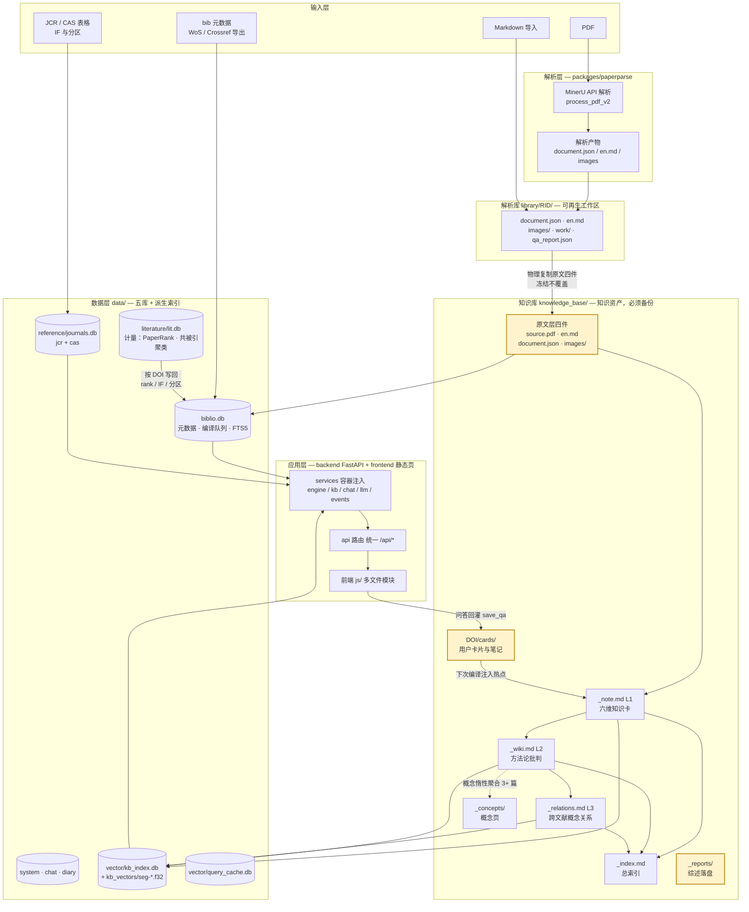
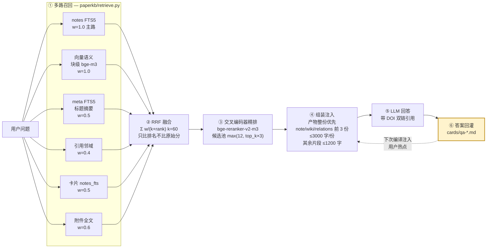
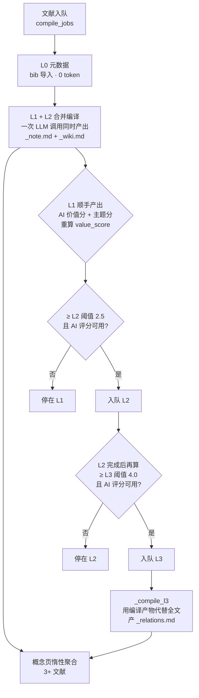
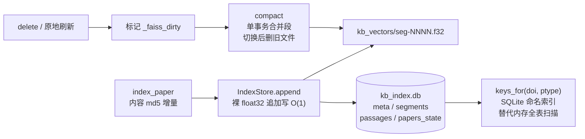

# PaperAgent 知识库设计说明

> 面向开发者的架构与设计哲学文档。描述 PaperAgent 如何把 PDF 文献编译成一座
> 「LLM Wiki + RAG」知识库，供 AI 与人类长期检索、问答、增值。
>
> 配套文档：`docs/DATA-LAYOUT.md`（数据放哪）· `docs/VERSIONING.md`（怎么升级）·
> `docs/RELEASE-CHECKLIST.md`（怎么发布）。本文件描述**为什么这样设计**。
>
> 文档口径核对日期：2026-09-21（与 `APP_VERSION=1.3.0` 同批核实，逐条对代码验过）。

---

## 0. 核心架构图

### 0.1 全局分层



图中**黄色**=用户资产（不可再生，绝不被系统自动覆盖）。其余产物均可重建：
`library/` 与 `data/vector/` 可全量重建，`_note/_wiki/_relations/_concepts/_index` 可由编译重跑再生。

### 0.2 一次问答的检索链路



### 0.3 编译与自动升级链



**判据要点**：入队幂等与「产物确实在盘上」是**同一个函数**
（`Compiler._artifact_exists`）。因此界面显示「已完成」与「重新入队会不会跳过重建」
永远同真同假，不会各自漂移。产物被清理后，陈旧 `done` 行会被判为
**待重建**（`kb_list` 的 `stale` 字段）而不是继续显示「已完成」。

---

## 1. 设计哲学

### 1.1 核心命题：编译贵、检索贱

大语言模型读全文很贵（一篇论文 20-60k token），但知识一旦提炼成结构化笔记，
检索和问答就极便宜（问答注入预算 8000 字符 ≈ 4k token）。PaperAgent 的知识库
围绕这一不对称性设计：

- **一次性编译**：每篇文献只在入库时付出一次「读全文」的成本，产出结构化知识卡。
- **无限次廉价检索**：之后所有问答、关联、浏览都只读编译产物，不再碰全文。

这与 Karpathy 提出的「LLM Knowledge Bases」工作流同源——**文档 -> 编译 -> 链接
-> 问答 -> 回灌**的飞轮：知识不是存进去就完，而是越用越厚。

### 1.2 两条主线：LLM Wiki 与 RAG

| 主线 | 角色 | 落地形态 |
|---|---|---|
| **LLM Wiki** | 知识的「人类可读」组织：分级笔记、概念页、双链、来源可溯 | `_note.md` / `_wiki.md` / `_relations.md` / `_concepts/` + wikilink，Obsidian 直接打开即图谱 |
| **RAG** | 知识的「机器可检索」组织：六路召回 + RRF 融合 + 交叉编码器精排 + 预算注入 | FTS5 三表 + 向量索引（`kb_index.db`）+ `bge-reranker-v2-m3` 精排 |

两者共享同一份编译产物：Wiki 是它的呈现层，RAG 是它的检索层。编译一次，两边受益。

### 1.3 三条不可妥协的原则

1. **来源可溯**：每条编译内容都带段落 ID（`[P001]`）或 DOI 引用，知识不脱离原文。
2. **用户内容神圣**：用户的卡片、笔记、手动编辑永不被系统自动覆盖（冻结原则）。
3. **缺失不惩罚**：无 bib、无影响因子、无被引的文献，其价值评分权重等比归一化到
   已有字段，不会因为「数据不全」被埋没。

---

## 2. 三级编译理念

编译分三级，逐级加深。**省 token 的关键不是少读，而是让下级不重读全文**。

```
L0 元数据   bib 导入，0 token                    -> papers_meta（元数据唯一权威）
L1 知识卡   六维总结 + 概念 + AI 价值分/主题分    -> _note.md
L2 深度卡   方法论批判 / 可复现性 / 应用转化      -> _wiki.md
L3 关系层   用编译产物代替全文做跨文献分析        -> _relations.md
概念页      L1/L2 概念惰性聚合（3+ 文献）        -> _concepts/<slug>.md
```

**L1 与 L2 不是两次调用**：`_compile_l1` 一次 LLM 调用同时产出两级
（`_note.md` + `_wiki.md`），省 50% 全文输入。`_compile_l2` 只在合并结果缺
`wiki` 时作为回落路径走。

### 2.1 L1+L2 合并编译的输出契约

输出为严格 JSON，本地渲染成两级 Markdown。六维总结带段落引用：

```json
{"one_liner": "一句话贡献",
 "background": {"text": "...", "paras": ["P001"]},
 "method": {...}, "result": {...}, "conclusion": {...},
 "innovation": {...}, "limitation": {...},
 "concepts": [{"name": "概念名(英文)", "definition": "定义"}],
 "tags": ["..."], "ai_value": 4, "topic_score": 0.8}
```

### 2.2 L3 概念关系层（省 77% token 的关键）

L3 不再读全文，而是**用编译结果代替全文**做跨文献分析：

1. LLM 读本文 L1+L2，提取 5-8 个检索关键词；
2. 用关键词搜索向量索引，取回相关文献的**编译结果**（非全文）；
3. LLM 分析概念演进、方法论连接、研究趋势 -> `_relations.md`。

**每篇相关文献的取文预算**：`_note.md` ≤1200 字 + `_wiki.md` ≤1500 字
（`_L3_NOTE_CHARS` / `_L3_WIKI_CHARS`）。2026-09-23 由 1500/750 放宽——旧实现用
`limit//2` 让 wiki 只拿到 note 的一半，而实测 `_wiki.md` 中位 2137 字 ⇒ L3 只看得到 35%，
且从尾部切（丢掉「可复现性/应用转化」两节），偏偏 L3 的全部价值就是跨文献关系判断。

**输入规模每次编译都落日志可核**（`L3 输入规模: ...`）：2026-09-23 实测本文 2253 字 +
相关 7 篇 = **合计 19.4K 字**。放宽的是**每篇取多少字**，同时新增分数过滤把低分候选丢掉，
所以总量与旧口径同量级；相比「把相关文献全文一起喂进去」仍省约 77%。

**分数过滤防呆**（`_filter_by_score`，`_L3_MIN_SCORE=0.30` / `_L3_MIN_KEEP=5`）：
低于阈值的候选丢弃，但**过滤后不足 5 篇就退回原列表**——阈值宁可无效，
也不能把相关文献清空（清了 L3 反而没材料可分析）。

**降级通道**：关键词提取失败时回退到「已聚合概念名 + bib 关键词」（零 LLM 成本），
检索无结果时也走降级而非硬失败——L3 缺失不应让整篇编译失败。

### 2.3 编译结果链（防重复）

每级编译产出后生成压缩版（≤1000 字）存入 `compile_ctx`，下级编译提示词注入上级
压缩版并明确指令「已有要点已提供，只补充/深化，不重复」。等级分工不重叠：

- L1 = 全景（一句话 / 六维 / **核心概念（含定义）** / 概念标签 / 关键段落引用）
- L2 = 深度（方法论批判 / 可复现性 / 应用转化，禁止重复六维）
- L3 = 网络（跨文献概念关系 / 方法连接 / 研究演进）

**`## 核心概念` 这一段是给 L3 用的**：L1 的输出契约里本来就有
`concepts:[{name, definition}]`，但 2026-09-23 之前 `_render_note` 只渲染 tags ⇒
L3 看每篇文献时**只有 ≤8 个标签词、没有定义锚点**。现在 `_note.md` 把它落成
`- **概念名**：定义`，L3 才能判断「两篇讲的是不是同一个概念」。

### 2.4 价值评分驱动的选择性编译

不是每篇都值得编到 L3。价值评分决定编译深度：

```
value_score = 0.20*IF档 + 0.15*被引 + 0.25*AI价值 + 0.15*主题
            + 0.10*年份 + 0.10*PaperRank + 0.05*库内被引
```

- 归一化到 0-5；缺失字段权重等比放大（不惩罚）。
- AI 价值分与主题分在 L1 编译时顺手产出（零额外成本）。
- 门槛：**L1 全做** / L2 ≥ 2.5 且 AI 评分可用 / L3 ≥ 4.0 且 AI 评分可用。
- 自动升级链：L1 保存评分 -> 达标入队 L2 -> L2 完成 -> 达标入队 L3。
  **L2→L3 的判定在 paperkb 内部**（`_maybe_auto_l3`），不在 backend 的
  `CompileWorker` 里——worker 只做 L1→L2，不要重复实现（会双份入队）。

---

## 3. 数据流与存储

### 3.1 飞轮

```
输入层  bib(元数据权威) / JCR表->journals.db / PDF->解析 / md导入 / 缺DOI->WOS检索式
  |
存储层  library/<RID>/ (解析工作区) --物理复制原文四件--> knowledge_base/<DOI>/
        data/biblio/biblio.db: papers_meta / citations / compile_jobs / concepts / FTS5 三表
        data/reference/journals.db: jcr + cas（IF / 分区）
        data/literature/lit.db:   PaperRank / 共被引聚类 / IF 补全（按 DOI 写回 papers_meta）
        data/vector/kb_index.db: 编译产物向量（bge-m3）+ kb_vectors/seg-*.f32 段文件
  |
编译层  L0 -> L1+L2合并 -> L3 -> 概念页(惰性) -> 主题MOC(未实现)
  |
检索层  六路召回(notes_fts/向量/meta_fts/引用邻域/卡片/附件全文)
        -> RRF 融合 -> bge-reranker 精排 -> 预算注入 <=8000 字 -> LLM问答
  |
回灌    save_qa -> cards/qa-*.md -> 下次编译经 _qa_context 注入（飞轮闭环）
```

### 3.2 知识库目录规范

```
knowledge_base/
├── _index.md            # 总索引（自动生成，含编译等级与链接）
├── _concepts/           # 概念页（3+ 文献惰性聚合）
├── _reports/            # 综述 / 报告落盘（kb_write_report 工具写入）
├── .trash/              # 回收站（移出知识库的篇目录，可一键恢复）
└── <DOI>/               # 文献页 = 自包含（Obsidian 打开一个目录看全部）
    ├── source.pdf       # 原文（物理复制）
    ├── en.md            # 干净英文原文
    ├── document.json    # 段落结构（para_id 体系的真相源）
    ├── images/          # 图
    ├── zh.md / en_zh.md # 翻译变体（中文 / 双语对照）
    ├── _note.md         # L1 知识卡
    ├── _wiki.md         # L2 深度卡
    ├── _relations.md    # L3 概念关系
    └── cards/           # 用户工作产物（永不被覆盖）
        ├── translate-<slug>.md
        ├── summary-<slug>.md
        ├── qa-<slug>.md
        └── note-<slug>.md
```

- **自包含**：原文层四件物理复制进 kb，整个目录可拷走独立使用，不依赖 library。
- **冻结**：kb 原文层放入后系统不自动改动；重新解析产生新版本由用户手动决定同步。
- **身份归一**：键可为 DOI / RID / 目录名 / md5 目录，统一归一化（DOI 保持原样）。
- **按需创建**：`cards/` 与 `_global/cards/`（全局问答卡片）都是**用到才 mkdir**，
  不是预置目录；`_topics/`（主题 MOC）**尚未实现**。

### 3.3 数据库与派生索引

| 文件 | 内容 | 可重建性 |
|---|---|---|
| `data/biblio/biblio.db` | papers / papers_meta / identifiers / citations / doi_md5_map / compile_jobs / compile_ctx / concepts / kb_edited / kb_trash / FTS5 三表 | 业务数据**不可重建**，必须备份 |
| `data/reference/journals.db` | jcr（22249 行）+ cas（21772 行） | 完全可重建（表格重新导入） |
| `data/literature/lit.db` | papers（文献计量主源）/ paper_ranks / citations / FTS / 向量 | 可由 AI 检索重建，但重建要重新联网 |
| `data/system/app.db` | 设置 / 用量 / 插件 / 任务 | 不可重建（设置与用量） |
| `data/chat/chat.db` | 会话与消息 | **不可再生**，必须备份 |
| `data/vector/kb_index.db` | 段清单 / 段落元数据 / 死信表 | **纯派生**，丢了重建即可 |
| `data/vector/query_cache.db` | 查询向量缓存（LRU 5000 行） | **纯派生**，不备份 |
| `knowledge_base/` | 原文 + 编译产物 + 卡片 + 综述 | 编译产物可再生；**卡片 / 个人笔记 / 综述不可再生** |

**迁移清单**（与 `docs/DATA-LAYOUT.md` §3 一致，以那份为准）：`data/` 五库
+ `manifest.json` + `knowledge_base/` + `用户提供的文献/` + `attachments/`。
（旧版本文档曾写「迁移三件套 = kb + biblio + journals」，**已废弃**——chat.db
不可再生、system.db 存设置，都不能丢。）

FTS 索引**存相对路径**：`notes_fts(doi, filename, content)` 的 `filename` 列
用于跨通道按文件去重与「产物整份优先」判身份（如 `_note.md`、
`attachments/si/xxx.pdf`）。派生索引（`kb_index.db` + 段文件 + 查询缓存）一律
不进迁移清单——数据层模块各自持有 sqlite，业务模块不得出现裸 `sqlite3.connect`
（`backend/tests/test_version_contract.py` 守卫）。

---

## 4. 检索设计（RAG）

### 4.1 问答流程（预算受控）

```
问题 -> 多路召回：notes_fts + 向量语义(块级) + meta_fts + 引用邻域 + 卡片 + 附件全文
     -> RRF 融合（Σ w/(k+rank)，k=60；只比排名，不比跨通道原始分数）
     -> bge-reranker-v2-m3 二阶段精排（候选池 max(12, top_k*3)，失败/无 key 静默退回 RRF 序）
     -> 注入上下文（预算 8000 字符；**产物整份优先**：note/wiki/relations 取前 3 条读整份
        ≤3000 字/份，其余用命中片段；片段上限统一 1200 字）
     -> LLM 回答（带 [[DOI]] 引用）
     -> 答案回灌 cards/qa-*.md（用户一键，防噪声）
```

五路召回权重与通道（`retrieve.py`）：`notes 1.0` / `vector 1.0` / `meta 0.5` /
`cards 0.5` / `fulltext 0.6` / `neighbor 0.4`。

四个口径要点（2026-09-21 起）：

- **融合只认排名**：余弦/BM25/命中长度本来就不可比，早期用硬编码权重（1.0/0.9/0.6）
  拼分数只是把不可比藏起来。RRF 让「多路都召回的条目」自然上浮。
- **两阶段检索**：召回（便宜、求全）与精排（贵、求准）分离，重排只跑
  `max(12, top_k*3)` 条候选（问答 `top_k=6` ⇒ 池 18）。库层默认关闭重排
  （`rerank_enabled=False`），backend 显式开启；无 key / 抛错时静默降级不阻断。
  ⚠️ `KbSettings.rerank_pool=30` 是**死配置**（全仓无读取点），实际池大小由
  `retrieve.RERANK_MIN_POOL` 与 `top_k` 决定——改口径要改后者。
- **small-to-big 注入**：向量按 **900 字**小块匹配（精度，同节 **120 字**重叠），
  注入时扩到**所属小节整段**（≤1200 字，上下文完整）。扩展前后都会校验首末块的
  `chunk_md5`，文件被外部改动则退回单块——宁可窄，不可错。
  ⚠️ `textseg.split_chunks` 的函数默认值是 1200/160，向量索引路径**显式传**
  900/120。索引口径以 `vector.CHUNK_CHARS` / `CHUNK_OVERLAP` 为准。
- **产物整份优先（2026-09-21）**：注入按 `file` 判身份而不是按 `source`——凡
  note/wiki/relations 一律读**整份产物**（≤3000 字/份，前 3 份），不再拿片段
  （实测片段在 570 字处硬切，把同一份 `_note.md` 里「研究结果」的做功密度 1.75 J g⁻¹、
  等长应力 18.4 MPa、保持指数 96.4% 全切掉，模型只能答「数值被截断」）。
  组装逻辑收在 `paperkb.qa_context`（检索层决定注入文本，前后端解耦）。

### 4.2 检索预算与成本对照

| 入口 | 注入预算 | 依据 |
|---|---|---|
| 知识库问答（`qa` 模式） | **8000 字符**（≈4k token） | `chat_service` 显式传 `budget_chars` |
| 检索层默认 | 16000 字符 | `retrieve.BUDGET_CHARS` |
| 管理模式（`manage`） | 20000 字符 | `MANAGE_RETRIEVAL_BUDGET_CHARS` |
| agent 工具 `kb_recall` | 4000 字符（序列化后） | `kb_tools._RECALL_TRIM` |
| agent 工具 `kb_paper_products` | 16000 字符（每份 ≤3000，最多 8000/份上限） | `kb_tools._PRODUCTS_TRIM` |

| 模式 | 单问上下文 | 长期成本 |
|---|---|---|
| 全文 RAG | 20-60k token | 每次问答都贵 |
| **编译产物 RAG** | 8000 字符 ≈ 4k token | 降一个量级，且答案质量更高（精炼知识） |

额外成本项：查询向量（bge-m3，¥0.07/M token，几十 token/次，带 SQLite 查询缓存）
+ 重排（bge-reranker-v2-m3，¥0.07/M token，池约 18 条 → ≈¥0.001/问）。
一次实测问答（glm-5.3-flash）：注入 7.5k 字 → 2737 prompt + 4020 completion ≈ ¥0.013。

### 4.3 两条注入路径必须同时检查

证据注入有**两条互不复用装配代码**的路，改任一条都要显式检查另一条：

1. **问答路径**：`chat_service`（mode=qa）-> `paperkb.qa_context()` ->
   `retrieve.build_context()` —— 已实现「产物整份优先 + 小节扩展片段」。
2. **agent 工具路径**：`kb_tools.run_tool("kb_recall")` -> `kb.recall()` ->
   `_trim(...)` —— 只有片段；`kb_paper_products` 是模型主动取整份产物的出口。

两条路各自实现切片/预算口径，天然会漂移（用户最初反馈的「数值被截断」就是这个后果）。
工具结果裁剪按**整条条目**取舍（`_trim_items`），不对序列化后的 JSON 字符串做边界
截断——后者会切坏结构并丢掉尾部条目。

### 4.4 上下文隔离

翻译/编译产物**落盘文件**，不进入用户后续问答的上下文。问答只含检索注入的编译
片段，不含翻译/编译会话历史——问答 token 与质量都不受翻译会话污染。

### 4.5 切分与边界（「命中段 = 注入段」）

检索质量的上限由**切分**决定。本知识库统一走 `paperkb/textseg.py` 四个原语：

| 原语 | 作用 | 为什么 |
|---|---|---|
| `strip_frontmatter` | 去 YAML frontmatter | `type/doi/tags` 是模板噪声：占嵌入预算、还被当成「检索证据」返回 |
| `split_chunks` | 标题感知分块（段落→句子→硬切；跨小节贪心打包；同节重叠） | 整文件 1 向量会把多主题文档「语义平均化」；硬截断会切碎句子与公式 |
| `boundary_trim` | ≤上限截断，优先 段落>行>句>逗号 边界，且不在 `$…$` 内断开 | 注入/回填截断不切半句 |
| `window_around` / `db.match_window` | 命中位置 ±300 字窗口 | 中文 LIKE 兜底的片段必须是**命中位置**，不是文件开头 |

**片段上限只有一套口径：1200 字**（`db.NOTE_WINDOW_LIMIT` = `vector.SNIPPET_CHARS`）。
2026-09-21 修两处：① 主路曾用 SQLite `snippet(...,12)` 的 token 窗口、兜底用 700 字窗口
⇒ 同一通道两种口径，中英混排下 token 窗口极不稳定；② `match_window` 的窗口宽度**正好
等于 limit**，`boundary_trim` 因此判定「无需裁」原样返回 ⇒ 右边界是**硬切**（实测尾部
出现「…剩磁仅1.」「…为水基的」）。现在窗口比 limit 宽 `slack` 字再 trim，右边界真正
落到边界上，且两条路共用一个 `_query_anchors`。

关键不变量：块的 `text == body[start:end]`（偏移可逐字节切回原文），且索引时记下
每块的 `chunk_md5`——文件被外部改动后偏移会失准，此时**返回空片段**而不是错位文本
（宁可无证据，不可给错证据）。向量索引随内容 md5 变化**原地刷新**，重编译不再留下
「新文本 + 旧向量」的错配；分块数减少时自动清理旧块键。

### 4.6 向量索引的存储形态（10 万篇级）

旧形态每次编译都重写整份 npy，写放大随篇数线性增长。现改为
**段式追加写 + manifest + 原子压实切换**：



- 维度变化自动封段开新段；段名用 `meta.next_seg` **单调计数**，不复用已删段名。
- 查询：faiss `IndexFlatIP` 增量 `add`；删除/原地刷新后置脏，下次查询前整表重建。
- 容量设计取舍：内存向量数组与 `_idx_to_key` 严格对齐（约 280 个测试依赖该不变量），
  换成 ANN（HNSW/IVF）之前不动这个契约。
- 进程级单例（`get_index_store` / `get_kb_vector_index`）避免每次请求重载全索引。

### 4.7 索引可观测性与死信重试

四个接口（`/api/kb-meta/index/*`）：`status`（篇数/块数/模型/段数/健康）、
`scan`（对账磁盘与索引）、`compact`（手动压实）、`retry`（重放死信）。
embedding 失败**不阻断编译**，缺陷键落 `dead_letter` 表待重试——这是
「编译成功但没进检索」这类静默故障的对账依据。规模仿真脚本 `tools/index_scale_sim.py`
可按 N 篇模拟并给出每篇字节/耗时、头尾比、近邻 vs 全量检索延迟。

### 4.8 检索质量回归门

检索口径（融合、重排、切分）每次改动都会影响召回质量，所以质量要**可度量**：

```
python tools/retrieval_eval.py --bootstrap      # 从当前 KB 生成自检索评测集（合成标签，冒烟基线）
python tools/retrieval_eval.py --golden <人工标注集>  # 三档消融 + 阈值门（不过则退出码 1）
```

三档消融 = `notes`（只有 FTS） / `+vector`（多路不重排） / `+rerank`（多路+精排），
指标 `recall@k` / `MRR` / `nDCG@10`（都先归并到「文献」一层，同一篇被多种键写法召回
不重复计分）。阈值门除了绝对下限，还有一条**相对门**：全档不得比 `notes` 档退步
超过 `--tolerance`——防止「加了向量/重排反而更差」这类静默退化。

⚠️ `--bootstrap` 的查询摘自已编译笔记原文，**偏向向量路**，只能当冒烟基线；
真实结论要用人工标注集（每条 `{"query","relevant":[doi],"kind":"human"}`）。

---

## 5. 卡片式用户工作产物

用户与知识库的交互沉淀为卡片（`cards/`），带 frontmatter（type/doi/scope/para_ids/tags）：

- 编译/问答**按需读取**卡片（按 type/para_ids/tags），不整读 en.md -> 省 token。
- 用户卡片永不被系统覆盖（与编译产物解耦）。
- 问答回灌：`save_qa` 把有价值的问答存成 `card-qa`，下次编译经 `_qa_context`
  注入提示，让六维总结侧重用户关注的热点——这是飞轮的「回灌」一环。
- 综述/报告走 `_reports/`（`kb_write_report` 工具），与卡片分开放：卡片是知识单元，
  报告是长文产物。

---

## 6. 工程约定

- **独立算法包**：知识库逻辑封装在 `packages/paperkb/`，经唯一门面 `api.py` 被
  backend 调用；包内不硬编码绝对路径（根路径由调用方注入），不直连 LLM 供应商
  （统一走注入的 provider/guard）。
- **翻译与编译共享前缀**：同一模型下，翻译与 L1 编译复用逐字节相同的英文全文前缀
  （`shared_ctx`），命中 prompt 缓存，组合成本低于分开调用。
- **LLM 输出防御式解析**：编译/翻译的 JSON 输出经容错解析（剥围栏 / 非法转义修复 /
  推理前后缀容忍 / 截断子对象回收），并通过提示词约束模型不输出 LaTeX，从源头降低
  解析失败率。失败降级而非硬 raise。
- **幂等与产物校验**：编译任务 `done` 状态需叠加「产物确实在磁盘上」第二判据，
  避免产物被清理后永远挡掉重建。**同一判据供三处共用**：入队幂等（`queue`）、
  自动升级（`_maybe_auto_l3`）、界面显示（`compile_status` / `kb_list`）。
- **期刊名匹配三级兜底**（2026-09-21）：① ISSN 精确匹配（首选，绕开写法差异）
  ② 期刊名规范化（`&` ≡ `and`、大小写/标点/连字符归一）
  ③ 城市消歧后缀兜底（`Children` -> `Children-Basel`，**仅主键落空时**启用，
  同键对应多刊则整键弃用）。仍未覆盖 ISO 缩写（`J. AM. CHEM. SOC.`），
  需缩写列数据。

---

## 7. 路线图与已知问题

### 已落地

- 三级编译（L1+L2 合并 / L3 关系层 + 降级通道）+ 价值评分自动升级
- FTS5 三表检索 + **块级**向量索引（bge-m3）
- **向量索引段式追加写 + manifest + 原子压实**（`kb_index.db` + `seg-*.f32`），
  进程级单例，SQLite 命名索引替代内存全表扫描；索引健康四接口 + 死信重试
- 多路召回 + **RRF 融合** + **bge-reranker-v2-m3 二阶段精排**（可关，失败降级）
- 切分/截断统一走 `textseg` 原语（标题分块、边界收尾、命中窗口）+ **small-to-big 注入**
- **产物整份注入**（问答路径 `build_context` + agent 工具 `kb_paper_products`）
- 查询向量 SQLite 缓存（`data/vector/query_cache.db`，LRU 5000）
- 检索质量三档消融评测 + 阈值回归门（`tools/retrieval_eval.py`）
- 卡片式用户产物 + 问答回灌飞轮；综述落盘 `_reports/`
- 编译状态**以产物为准**（陈旧 done 行判为待重建，界面不再虚报「已完成」）
- 自包含知识库目录 + Obsidian 双链兼容

### 待完善

- **主题 MOC**：`_topics/` 导航索引尚未自动生成（需要用户维护主题清单才有意义）。
- **覆盖率自检 UI**：后端四接口已就位，前端「索引健康」卡片未做（现靠
  `index/scan` 对账）。
- **人工标注评测集**：评测脚本已就位，但标签集仍是合成的；文献量上来后需标注
  50~100 条真实问句才能给融合/重排下结论。
- **ANN 索引**：当前 `IndexFlatIP` 全量精确检索。10 万篇以内可接受；再往上需换
  HNSW/IVF，届时才动「内存数组与键严格对齐」这个契约（约 280 个测试依赖它）。
- **embedding 本地部署**：当前走 SiliconFlow API；本地化（onnxruntime/GPU）已核算
  但暂缓，按配置项预留。
- **概念页聚合**：已做名字归一化，但仍是字符串键；后续可加别名表 / 语义聚类。
- **ISO 缩写期刊名**：`J. AM. CHEM. SOC.` 这类缩写仍匹配不上，需 JCR 缩写列数据。
- **译文回灌**：zh.md 尚未进入检索（当前只索引编译产物）——**按用户决定不做**
  （AI 使用不受语言限制）。

---

## 8. 关键代码索引

| 想改什么 | 去哪个文件 |
|---|---|
| 三级编译、L1/L2/L3 提示词、自动升级 | `packages/paperkb/paperkb/compile.py` |
| 价值评分公式与阈值 | `packages/paperkb/paperkb/score.py` |
| 多路召回、RRF 融合、精排、注入组装 | `packages/paperkb/paperkb/retrieve.py` |
| 切分 / 边界截断 / 命中窗口原语 | `packages/paperkb/paperkb/textseg.py` |
| 向量索引（增量、段文件、压实、死信） | `packages/paperkb/paperkb/vector.py` + `db.py::IndexStore` |
| 表结构、FTS5、编译队列、回收站 | `packages/paperkb/paperkb/db.py` |
| journal 匹配与规范化 | `packages/paperkb/paperkb/journals.py` |
| 知识库门面（backend 唯一入口） | `packages/paperkb/paperkb/api.py` |
| agent 工具（kb_recall / kb_paper_products / kb_write_report） | `backend/app/services/kb_tools.py` |
| 问答模式与上下文注入 | `backend/app/services/chat_service.py` |
| 后台编译 worker | `backend/app/services/compile_worker.py` |
| 知识库/编译/索引 HTTP 接口 | `backend/app/api/kbmeta.py` |
| 前端知识库面板 | `frontend/js/kb.js` |
| 前端对话与回灌 | `frontend/js/chat.js` |

---

## 9. 用 Obsidian 打开

知识库全部产物为 Markdown + wikilink，`knowledge_base/` 本身就是一个 Obsidian
vault。打开即获得：双链图谱、全文搜索、概念页聚合、来源段落跳转——零额外开发。
编译产物可再生，但用户卡片与个人笔记不可再生，删除前请备份。
