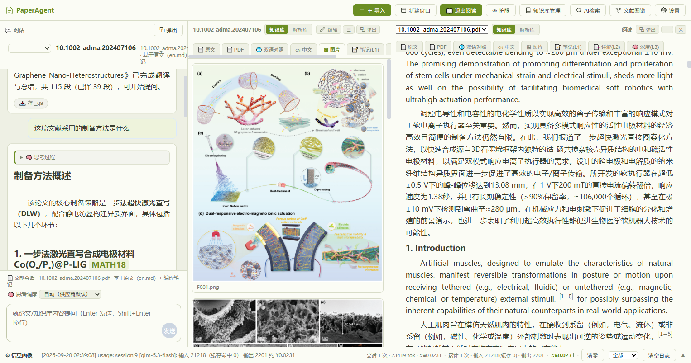
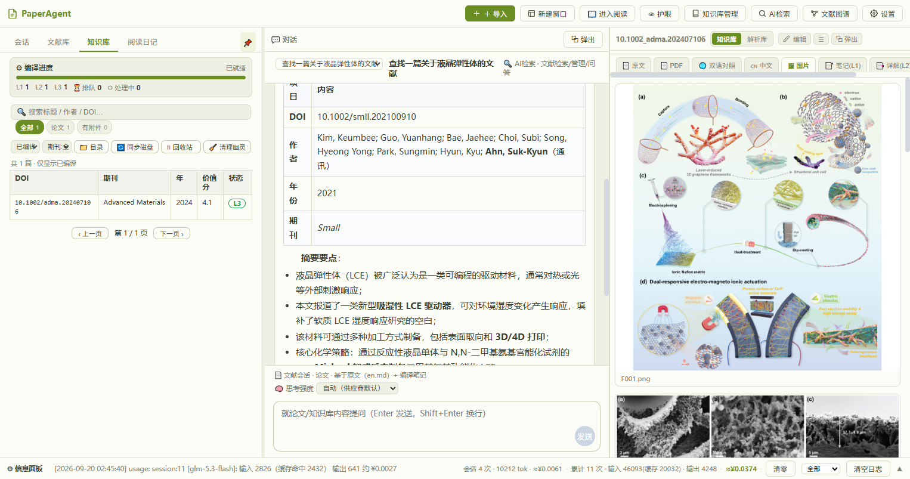
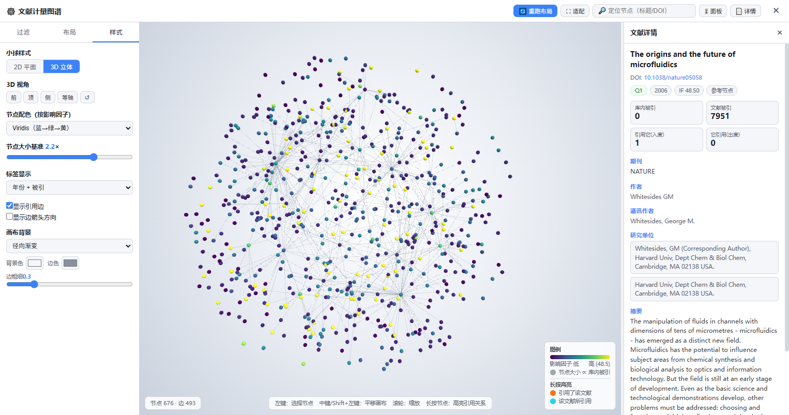

# PaperAgent 新用户操作手册

> **一句话**：把 PDF 丢进来，它替你**解析**成干净的英文全文、**翻译**成中文、**编译**成能直接读的笔记与深度解读，然后你可以就这些内容随时**提问**。
>
> 适用版本：**v1.3.0**（Windows 64 位）　|　形态：免安装绿色包（`PaperAgent-v1.3.0-win64.zip`）
> 本手册按**功能**分章，每章都是「怎么用 → 看哪里 → 要不要花钱」。只想先跑起来，读第 1、2 章就够。

---

## 0. 三分钟看懂它在干什么

### 0.1 它替你做的四件体力活

| 体力活 | 它做什么 | 你要花的时间 |
|---|---|---|
| **解析** | 把 PDF 拆成段落/标题/图/公式/表格，顺带修正乱码、断词、上下标 | 一篇 1~5 分钟（自动） |
| **阅读与翻译** | 生成干净英文全文 `en.md`、中文 `zh.md`、中英对照 `en_zh.md` | 自动，可随时中止 |
| **编译** | 把一篇论文压成一张**知识卡**：一句话贡献 + 六维笔记 + 概念标签（L1），再往上做深度批判（L2）、跨文献关系（L3） | 自动排队的后台任务 |
| **问答** | 基于你库里的原文与笔记回答问题，并标注来源 | 提问即答 |

### 0.2 一条流水线（重要：理解它就不会迷路）

```
                  ┌──────────────── 你只做这一步 ────────────────┐
   PDF ──▶ 「＋ 导入」 ──▶ 解析 ──▶ 落盘 ──▶ 纳入知识库 ──▶ 编译 ──▶ 翻译
                          │         │           │            │        │
                          │         │           │            │        └ zh.md / en_zh.md
                          │         │           │            └ _note.md(L1) / _wiki.md(L2) / _relations.md(L3)
                          │         │           └ knowledge_base/<DOI>/
                          │         └ library/<DOI>/   （解析车间：en.md / document.json / images / work）
                          └ 排队中 → 解析中 → 已解析 →（复核门控）→ 翻译中 → 已译
```

### 0.3 先记住三个抽屉（**数据放哪**，后面第 13 章细讲）

- `library/` = **加工车间**。解析产物，删了能重建（但要重新解析、再花一次钱）。
- `knowledge_base/` = **你的书房**。笔记、卡片、译文、原文层，**这是资产，必须备份**。
- `work/` = **草稿纸**。随时可清。

### 0.4 哪些功能花钱、哪些白送

| 环节 | 扣谁的额度 | 能不能 0 成本 |
|---|---|---|
| 解析 | MinerU 配额 | ❌ 必须联网解析 |
| 翻译 / 总结 | LLM 额度 | ✅ 导入时选「仅解析：不翻译，0 token」 |
| 编译（L1/L2/L3） | LLM 额度 | ❌ 但 L1 很便宜（省着用见第 15 章） |
| 问答 | LLM 额度 | ⚠️ 有缓存命中会便宜（界面会标「缓存命中 · 0 token」） |
| **支撑信息 / 审稿意见导入** | 无 | ✅ **纯本地，0 API 成本** |
| 检索 / 图谱 / 日记 | 无（向量与重排按需少量） | ✅ 基本白送 |

---

## 1. 安装与第一次启动（3 步）

### 第 1 步：解压到**空目录**

把 `PaperAgent-v1.3.0-win64.zip` 解压到任意**空文件夹**，例如 `D:\PaperAgent-test`。

> ⚠️ 不要解压进有旧数据的目录，也不要放在只读位置（例如 `C:\Program Files`）。

### 第 2 步：放配置文件（可选，但推荐）

目录里有一份 `.env.example`。要用 AI 功能就把你的 `.env`（含 API Key）放到**与 `PaperAgent.exe` 同级**的位置——不懂怎么填没关系，**先跳过**，第 2 章可以在界面里填。

### 第 3 步：双击 `PaperAgent.exe`

- 弹出**原生窗口（自动最大化）**，右下角托盘出现同款图标。
- 首次启动会在 exe 同目录自动创建 `data/`、`knowledge_base/`、`library/`、`logs/`、`work/`，并把**期刊分区/影响因子库**毫秒级就位（不需要你导入任何 Excel）。

**关窗 ≠ 退出**，这是最容易踩的坑：

| 你想做的事 | 正确操作 | 结果 |
|---|---|---|
| 暂时收起窗口 | 点窗口右上角 **X** | 隐藏到托盘，**后台任务继续跑** |
| 重新打开窗口 | 双击托盘图标，或托盘右键「🖥 显示主窗口」 | 窗口回来 |
| **完全退出** | 托盘右键 →「⏻ 退出 PaperAgent」，或命令行 `PaperAgent.exe --quit` | 释放端口、后台进程结束 |
| 用浏览器打开 | 托盘右键 →「🌐 在浏览器中打开」 | 浏览器访问 `127.0.0.1:8900` |

**其他启动期常见情形**

- **重复双击**：不会开两份。已在运行时会**唤起已有窗口**；若端口被占用且唤不起来，会弹窗告诉你三条出路（`--quit` / 托盘退出 / 任务管理器结束进程）。
- **端口冲突**：默认端口 **8900**。可在 `.env` 里用 `PAPERAGENT_PORT` 改；冲突时会弹窗提示先退出已运行的实例。
- **日志在哪**：`logs\paperagent.log`（启动即崩另有 `logs\crash.log` + 弹窗）。

---

## 2. 第一次配置：只填两个 Key

### 2.1 必填的只有两个

| Key | 用途 | 没有它会怎样 | 去哪申请 |
|---|---|---|---|
| `MINERU_API_KEY` | **解析**（把 PDF 变成结构化全文） | **直接拒绝解析**（免费通道与本地解析已按"质量优先"撤出生产链） | <https://mineru.net/apiManage>（可免费申请） |
| `DEEPSEEK_API_KEY` | **翻译 / 编译 / 问答** | 解析照旧，但 AI 功能不可用 | 你使用的 OpenAI 兼容服务商 |

### 2.2 怎么填（推荐走界面）

1. 顶栏 **`设置`** → 左侧 **`📄 解析`** → 在 **`MinerU 精准解析（主通道）`** 里填写 **`API Key`**；
2. 点底部 **`保存解析设置`**——保存后**立刻生效，不需要重启**，值会写入 exe 同目录的 `.env`；
3. AI 模型：**`🤖 模型`** → **`AI模型`** → **`＋ 新建`**，在弹窗「AI 模型供应商」里填 `名称` / `Base URL` / `模型` / `API Key`，先点 **`测试连接`** 确认通，再 **`保存`**，最后在列表里点 **`激活`**。

### 2.3 可选配置（不填也能跑）

| 键 | 作用 |
|---|---|
| `DEEPSEEK_BASE_URL` / `DEEPSEEK_MODEL` | 换成别的 OpenAI 兼容端点与模型 |
| `SILICONFLOW_API_KEY` 等 | 备用供应商（缺失则该供应商不出现在模型列表） |
| `QWEN_*` | **翻译专用模型**（也可在 `设置 → 🤖 模型 → 翻译模型` 里配） |
| `MINERU_LANGUAGE` | `auto`（默认，按首页字符集判中/英）/ `en` / `ch` |
| `MINERU_IS_OCR` | `auto`（默认）/ `on` / `off`（扫描件建议 `on`） |
| `PADDLEOCR_ACCESS_TOKEN` | 辅通道（参与双通道字符仲裁），不填则只用主通道 |
| `PAPERAGENT_PORT` | 默认 `8900` |

> ⚠️ **路径类键不要自己写**。随包 `.env.example` 原话：「默认就指向正确位置……同一个事实有两个来源时，实测会让数据写进错误的库」。

### 2.4 怎么确认配置成功

- **`设置 → ℹ️ 关于`**：能看到应用版本、界面版本、解析引擎、知识库库版本、`data_format`；
- **`📄 解析` 页顶部状态条**：显示 `MinerU 就绪（通道 …）`；若显示「未配置 MinerU API Key：解析功能已被禁用」就回去填 Key。

---

## 3. 界面速览



### 3.1 四个区域

| 区域 | 里面有什么 | 要点 |
|---|---|---|
| **顶栏** | 8 个按钮（见下表） | 所有「管理类」入口都在这里 |
| **左栏** | 4 个页签：`会话` `文献库` `知识库` `阅读日记` | **默认自动折叠**，鼠标靠近左缘自动展开；点 **`📌`** 可钉住常驻 |
| **中间桌面** | 左＝`💬 对话`，右＝`阅读器`；两者都能 **`⧉ 弹出`** 成浮动窗 | 拖动中间的分隔柄可调宽度 |
| **底部信息面板** | `⚙ 信息面板` 事件日志 + token 统计 | 出错先看这里 |

### 3.2 顶栏八个按钮

| 按钮 | 点了会怎样 |
|---|---|
| **`＋ 导入`** | 打开导入向导（PDF / Markdown / Bib / 支撑信息） |
| **`新建窗口`** | 开一个浮动阅读窗，可**并排对比**多篇；最多 5 个阅读区（含默认阅读器） |
| **`📖 进入阅读`** | 阅读模式：隐藏侧边栏，左对话 + 右侧双阅读器平分桌面（按钮变 `📖 退出阅读`） |
| **`👁 护眼`** | 默认/米黄主题一键切换 |
| **`知识库管理`** | 知识库总览 + 文献管理（批量重试编译、批量 L3、索引重建） |
| **`AI检索`** | 文献 AI 检索管理（bib 批量建库、检索、聚类、主题） |
| **`文献图谱`** | 全屏文献计量图谱（2D/3D） |
| **`设置`** | 设置中心（模型 / 解析 / 知识库 / 界面 / 插件 / 关于） |

### 3.3 底部：两个最重要的读数

- **token 统计**：`会话 …`（本次会话）、`累计 …`（历史总计）、`≈¥…`（估算费用）、`清零`（重新统计）。把鼠标停上去有明细提示。
- **事件面板**：解析/翻译/编译的每一步都记在这里。过滤下拉可选 `全部` / `仅错误` / `任务` / `LLM` / `系统`，`清空日志` 只清显示、不影响记录。

### 3.4 鼠标手势（一图流）

| 想做的事 | 怎么做 |
|---|---|
| 调宽左栏 / 对话区 / 阅读区 | 拖动对应分隔柄（有提示文字） |
| 调输入框高度、信息面板高度 | 拖上/下边缘的把手 |
| 浮动窗移动/吸附 | 拖标题栏；靠近视口左/右缘会自动吸附；拖回桌面区域自动停靠 |
| 阅读器文件卡排序 | 直接**拖拽**卡片（顺序会记住） |
| 放大图片 | 点击正文图片 → 全屏灯箱，滚轮缩放，点击或 `Esc` 关闭 |
| PDF 缩放 | `Ctrl + 滚轮` |

---

## 4. 功能一｜导入文献

入口：顶栏 **`＋ 导入`**。弹窗里有**四个页签**：

| 页签 | 用来导入什么 |
|---|---|
| **`📄 PDF`** | 论文 PDF（可一次多选，最常用） |
| **`📝 Markdown`** | 自己已有的 `.md`（需含 DOI 识别信息） |
| **`📚 Bib 引用`** | WoS 等导出的 `.bib` 参考文献条目 |
| **`📎 支撑信息·审稿意见`** | SI / 审稿意见 / 数据 / 笔记（**0 API 成本**） |

### 4.1 PDF：先选「模式」——这是最关键的决策

| 模式（界面原话） | 它做哪些事 | 适合谁 |
|---|---|---|
| **`解析 + 编译（默认）：解析 → 纳入知识库 → 编译L1，跳过翻译`** | 解析 + 纳入知识库 + 编译 L1 笔记，**不翻译** | **推荐**，省 token，先攒素材 |
| **`全流水线：解析 + 翻译 + 总结（同 PDF 自动去重）`** | 再加翻译 + 总结 | 只读几篇、想立刻看中文 |
| **`仅解析：不翻译，0 token`** | 只解析，不纳库、不编译、不翻译 | 只想拿到干净全文 `en.md` |

选好文件 → 点 **`导入`** → 结果区逐行报告：`✅ 文件名 → 已提交处理` / `⏭ 文件名 → 原因`，顶部汇总 `✅ 已提交处理 N 篇，跳过 M 篇`。

**重复导入同一篇**：会弹确认——「继续将**覆盖**之前的解析/编译结果……是否覆盖？」按需选。

### 4.2 导入之后，进度在哪看（4 个地方）

1. **左栏 → `文献库`**：卡片上出现条件按钮，如 `✕ 取消解析` / `重试` / `⏭ 立即翻译` / `🔍 复核`；
2. **对话区标题下方**：`状态: 排队中 | 解析中 | 翻译中 | 已译 | 已解析 | 失败 | ⏸ 待复核`，以及解析来源标记；
3. **底部信息面板**：逐步事件；
4. **左栏 → `知识库` 面板顶部 `⚙ 编译进度`**：`L1 n` / `L2 n` / `L3 n` / `⏳ 排队 n` / `⚙ 处理中 n` / `✗ 失败 n` + 进度条。

> **复核门控**：选了「全流水线」时，解析完不会立刻翻译，底部出现 `⏸ 待复核 N 篇（M 差异点） · ✅ 就绪 N 篇` 和两个按钮 **`▶ 开始翻译`** / **`⏭ 跳过审核翻译`**——先复核再翻译，避免把错字翻进译文。

### 4.3 支撑信息 / 审稿意见（**强烈建议用**）

1. 页签 **`📎 支撑信息·审稿意见`**；
2. **`父资源（可选）`**：搜索并选中主文献（留空＝单独存放）；
3. **`类型`**：`支撑信息 SI` / `审稿意见` / `原始数据/代码` / `笔记`；
4. 选文件 → `导入`。

它是**纯本地抽文本，0 API 成本**，结果会标 `（已进检索索引）` 或 `（未索引：非文本或抽取失败）`。导入后主文献卡片上出现 **`📎 附件 N`**，点开可看/打开/下载。

> 快捷入口：文献卡 **`⋯ 更多`** → **`📎 添加附件/审稿意见`**（会自动预选该篇为父资源）。

---

## 5. 功能二｜阅读一篇文献

### 5.1 三种打开方式

- 左栏 **`文献库`** 里点卡片；或卡片上的 **`💬 问答`**（同时开通该篇会话）；
- 左栏 **`知识库`** 点某一行；
- **`知识库管理 → 文献管理`** 的 **`📖 阅读`**。

### 5.2 阅读器：8 个标签页

| 标签（原话） | 内容 | 来自哪 |
|---|---|---|
| **`📄 原文`** | 干净英文全文 `en.md` | 解析产物 |
| **`📄 PDF`** | 原始 PDF 预览（pdf.js，可缩放/适宽） | 知识库内 `source.pdf` |
| **`🌐 双语对照`** | 中英对照 `en_zh.md`（主产物） | 翻译后生成 |
| **`🇨🇳 中文`** | 纯中文 `zh.md` | 翻译后生成 |
| **`🖼 图片`** | 论文中的图 | 解析时抽取 |
| **`📝 笔记(L1)`** | 知识卡 `_note.md` | 编译 L1 |
| **`📑 深度(L2)`** | 方法论批判/可复现性 `_wiki.md` | 编译 L2 |
| **`🔗 概念关系(L3)`** | 跨文献概念关系 `_relations.md` | 编译 L3 |

- **切换原文/译文就是点这些标签**（没有单独的"双语⇄原文"开关）；缺失的文件标签会自动隐藏。
- 左上角 **`知识库` / `解析库`** 两个来源按钮：前者是编译/翻译后的书房，后者是原始解析车间。
- 右上角：**`☰`**（卡片管理，勾选显示/隐藏/排序）、**`编辑`**（改当前文件 → `保存` 后会提示"插件自动生成将不再覆盖"）、**`⧉ 弹出`**。
- 点 **`新建窗口`** 可开多个浮动阅读窗并排对比（最多 5 个）。

### 5.3 阅读小技巧

- **公式**已渲染（KaTeX），围栏代码有高亮；
- **`[[双链]]`** 可点跳转，`> [!note]` 一类 callout 也会正常显示；
- 文件开头的 `---` 元数据会渲染成「属性」小面板，DOI/URL 可点；
- 悬停知识库列表行有**快速预览**。

### 5.4 「识别复核」是什么（A/B/C/D 四选一）

双通道解析（MinerU + PaddleOCR）在有分歧的段落上会请你裁决：

- 入口：文献卡 **`🔍 复核`**；
- 每个差异点给四个选项：**`A 保留 MinerU`** / **`B 用 PaddleOCR`** / **`C 两者皆可`** / **`D 都错`**；
- **只影响对应段落**，不是整篇重解析；处理完可点 `隐藏已处理`；
- 若显示 `🎉 无需复核`，说明差异都被自动化解了，直接去翻译。

---

## 6. 功能三｜和 AI 对话

### 6.1 四种会话，选对场景省一半 token

左栏 **`会话`** → **`新建会话`**，菜单里四项：

| 类型 | 界面原话 | 什么时候用 |
|---|---|---|
| **`💬 普通聊天`** | 不绑定论文，日常问答 | 闲聊、写作、翻译零散段落 |
| **`📚 知识库问答`** | 精简模式 · 基于编译产物问答（省 token，推荐） | **日常首选**：基于笔记/深度/关系回答 |
| **`⚙️ 知识库管理`** | 管理模式 · 问答 + 编译/元数据/期刊等工具调用 | 让它帮你批量编译、查元数据 |
| **`🔍 AI检索`** | 文献检索 · 检索/管理/问答一体化工具调用 | 检索、统计分析类问题 |

**怎么让 AI 读某篇文献**：在文献卡上点 **`💬 问答`**（会建立该篇专属会话）。输入框上方会显示当前上下文，例如：
`📄 文献会话 · <文件名> · 基于原文（en.md）+ 编译笔记`。

### 6.2 提问区怎么用

- 输入框占位提示：`就论文/知识库内容提问（Enter 发送，Shift+Enter 换行）`；
- **`🧠 思考强度`** 三档：`自动（供应商默认）` / `低（快，少推理）` / `高（慢，深推理）`。想省钱就调低（第 15 章）；
- 等待时的反馈链路：`⏳ 正在处理… 已等待 Ns` → `⏳ 已检索 N 个片段，正在思考…` → 回答里可能出现 `🧠 思考过程`（折叠）、`🔧 工具名`（调用记录）、`缓存命中 · 0 token`（命中缓存不花钱）。

### 6.3 把好答案留下来

回答尾部有保存按钮：`📥 存 知识库QA`（普通会话）或 `📥 存 _qa`（文献会话）。存下来就会进检索，下次提问能被召回，也能在知识库 `cards/` 里看到。

### 6.4 会话管理（左栏 `会话` 面板）

- 单条行内：`▾` 展开详情、`📥`/`📤` 归档/取消归档、`✎` 重命名、`✕` 删除；
- 批量：`全选` → `已选 N` → `批量删除`；`清空已归档` 一次性清理归档会话。

---

## 7. 功能四｜翻译与总结

### 7.1 三个入口

1. 导入 PDF 时选 **`全流水线：解析 + 翻译 + 总结（同 PDF 自动去重）`**；
2. 文献卡 **`⋯ 更多`** → **`🌐 仅翻译`**（只翻译，不纳库）；
3. 文献卡 **`⋯ 更多`** → **`📥 导入kb+译`**（纳入知识库 + 编译 L1 + 立即翻译）；
4. 待复核文献：卡片 **`⏭ 立即翻译`**，或底部 **`▶ 开始翻译`** / **`⏭ 跳过审核翻译`**。

### 7.2 产物在哪看

| 产物 | 在哪看 | 说明 |
|---|---|---|
| `en_zh.md` | 阅读器 **`🌐 双语对照`** | 中英对照主产物，模板可换 |
| `zh.md` | 阅读器 **`🇨🇳 中文`** | 纯中文 |
| `en.md` | 阅读器 **`📄 原文`** | 干净英文全文 |
| `summary.md`（总结） | 知识库 **`📁 目录`** 视图的文件列表 | 阅读器目前没有它的专属标签页 |

### 7.3 用什么模型

- **主模型**：`设置 → 🤖 模型 → AI模型`；
- **翻译专用模型**（可选）：同一页 **`翻译模型`** → `添加翻译模型`。可以存多个备选，点表格里的**圆圈**激活其中一个（同时只有一个生效）；想换模型就点另一个，立即生效。一个都不激活，或点 `不用专用模型（回落主模型）` → 用主模型翻译；
- **思考档位**：`设置 → 📚 知识库 → 编译 / 翻译策略`，可分别设「编译思考档」「翻译思考档」。
- **翻译批次上限**（同上一处）：每次请求发给模型的**最多正文字符数**，留空＝默认（专用模型 6000 / 主模型 12000）。
  - 分批**只在段落边界切，绝不切断句子**；单段超过上限时该段整段单独发送（不与其他段合并）；
  - 调大 → 调用次数更少更快，但超出模型输出能力会截断（截断会自动按单段补跑，不漏译，只是白花 token）；
  - 怎么定：先留空用默认跑一篇，看日志里有没有 `批截断`。有，就按日志给出的建议值往小调（日志会写成
    `批截断：3/12 段未译（本批 6120 字符，上限 6000），按单段补跑；若频繁出现，请把「翻译批次上限」降到 ≤3060`）。

---

## 8. 功能五｜知识库（把读过的文献变成自己的知识）

### 8.1 一句话：编译 = 把原文提炼成能直接读的笔记

| 层级 | 界面里的名字 | 产出文件 | 触发条件 |
|---|---|---|---|
| **L0** | 元数据（bib 导入） | `papers_meta` | 0 token |
| **L1** | 知识笔记 | `_note.md`（一句话贡献 + 六维笔记 + 概念标签） | **入库自动触发** |
| **L2** | 深度编译 | `_wiki.md`（方法论批判 / 可复现性 / 应用转化） | 价值分 ≥ 2.5 且 AI 评分可用 |
| **L3** | 概念关系 | `_relations.md`（跨文献关系分析，省 77% token） | 价值分 ≥ 4.0 且 AI 评分可用 |
| 概念页 | — | `_concepts/<概念>.md` | 3 篇以上文献提到同一概念时聚合 |

> **重要**：L1 与 L2 是**一次 LLM 调用同时产出**的（省一半全文输入），不是两次调用。

### 8.2 编译怎么做

1. 左栏 **`知识库`** 面板顶部 **`⚙ 编译进度`** 看整体（`L1 n` / `L2 n` / `L3 n` / `⏳ 排队 n` / `⚙ 处理中 n` / `✗ 失败 n`）；
2. 单篇：点列表行打开 **`📄 文献详情`**，按钮按下一级给出 **`编译L1`** / **`编译L2`** / **`编译L3`**；
3. **若某级标记完成但产物已不在磁盘**，按钮会变成 **`重建L1`** 这类，并且列表里标 `⚠ L1、L2 标记为已完成，但编译产物已不在磁盘（目录被清理过）——需重新编译`——**放心点重建**；
4. 三级都完成时按钮显示 **`✓ 三级已编译完成`**（禁用）；
5. 批量：顶栏 **`知识库管理` → `文献管理`**，用芯片 `全部` / `已编译` / `编译失败` / `可升级 L3` + 筛选（分区/年份/价值分/IF），全选后 **`批量重试编译`** / **`批量 L3 分析`**。

### 8.3 为什么有的文献停在 L1？

因为**价值分**不够（L2 门槛 2.5、L3 门槛 4.0）。价值分由影响因子档、被引、AI 价值分、主题分、年份、PaperRank、库内被引加权得出。影响因子来自**已随包内置的期刊分区表**——文库是空的时候，所有论文都算不到 L2（历次实测：空库 2.31 → L1；有库 3.48 → L2）。

### 8.4 知识库面板上的按钮

| 按钮 | 作用 |
|---|---|
| **`📁 目录` / `📋 列表`** | 目录树视图（可 `＋ 新建笔记`、重命名/删除目录）⇄ 表格视图 |
| **`🔄 同步磁盘`** | 把库记录与磁盘实际文件对齐，完成后信息条报告「已与磁盘对齐：N 个目录、M 条元数据，无不一致」 |
| **`🗑 回收站 (N)`** | 移出知识库的文献（**产物全部保留**，仅当库中无同名文献时可 `↩ 恢复`） |
| **`🧹 清理幽灵`** | 清掉"库里有记录、磁盘没目录"的幽灵记录（不可撤销，会二次确认） |
| 编译层级下拉 | `已编译（全部）` / `L1 完成` / `L2 完成` / `L3 完成` |
| 搜索框 | `🔍 搜索标题 / 作者 / DOI…` |

### 8.5 两个管理弹窗

- **`知识库管理 → 📊 总览`**：各级编译含义速查 + 底部 **`🛠 索引维护`** 区的 **`重建 FTS 索引`** / **`重建向量索引`**（检索变"笨"了就跑一次）；
- **`知识库管理 → 📄 文献管理`**：带筛选的批量操作台（上一节 8.2 第 5 条）。

### 8.6 你的知识库就是一个 Obsidian 库

`knowledge_base/` 目录本身就是标准 Obsidian vault（含 `[[双链]]`、callout、属性面板），可以直接用 Obsidian 打开、编辑、写卡片。注意：**放进来的文件是"冻结"的**，系统不会自动改你手写的内容。

---

## 9. 功能六｜AI 文献检索（paperlit）



**适用场景**：你手上有 WoS 导出的 `.bib`，想先建一个几百上千篇的"检索库"，再做排序、聚类、主题分析——**它和左栏的阅读知识库是两套东西**：左边管"精读"，这里管"面"。

入口：顶栏 **`AI检索`**。弹窗里有**六个页签**：

| 页签 | 干什么 |
|---|---|
| **`📥 导入`** | 建库主流程（①~⑥ 分步 + `🚀 一键全流程`） |
| **`🔎 检索`** | 三层漏斗检索（关键词 → 向量 → 重排） |
| **`📄 文献库`** | 分页浏览、单篇补全元数据 |
| **`🕸️ 图谱`** | PaperRank Top 20、共被引聚类 |
| **`🏷️ 主题`** | 按 WoS 类别/关键词聚合主题（**手动触发**） |
| **`⚙️ 设置`** | Embedding / Reranker 的 Key 与模型 |

### 9.1 建库六步（`📥 导入` 页）

| 步骤 | 操作 |
|---|---|
| ① **导入 bib 文献** | 「方式一：输入文件路径」→ `导入文件` / `导入整个目录`；或「方式二：上传文件」→ `上传并导入`（**有进度条**） |
| ② **文献清洗** | 设 `删除：年份 <` `删除：影响因子 <` `删除：分区不在` `删除：库内被引 <` 等，先 `计算预览` 再 `确认清洗`；`重算库内引用` 单跑 |
| ③ **补全元数据** | `补全全部待补全元数据`；也可 `生成 WoS 检索式` 去 WoS 补 |
| ④ **期刊名规范化 → 期刊指标关联** | `执行规范化` → `关联期刊指标（写入 IF / 分区）`（`预览当前期刊` 可先看效果） |
| ⑤ **PaperRank 计算** | `计算 PaperRank`（引用图谱排名） |
| ⑥ **向量索引** | `构建向量索引 (bge-m3)`（检索的语义通道） |
| 🚀 | **`一键全流程`** 把 ①~⑥ 串起来一次跑完；**注意它不含主题编译** |

### 9.2 检索页

- 标题即说明：**`🔎 文献检索（三层漏斗：关键词 → 向量 → 重排）`**；
- 输入 `检索词`（`输入关键词，Enter 检索`）→ `检索`；
- 排序四选一：`相关度` / `被引次数` / `年份` / `PaperRank`；`加载更多` 继续翻；
- 下方 **`🗑️ 检索结果缓存`**：`刷新缓存统计` / `清空缓存`。

### 9.3 主题：为什么要手动点一下

**主题**＝按「WoS 类别 / 关键词 / 研究领域」把文献聚成一个个主题包（有各自 slug 与文献数）。在 **`🏷️ 主题`** 页选字段与 `最少文献数`（默认 2）→ 点 **`编译主题`** → 提示「编译完成：N 个主题」，点行内 `详情` 看该主题包含哪些 DOI。

> 它是**唯一被刻意做成手动**的步骤：编译主题要花 token，所以不放进一键流程，由你决定何时花。

### 9.4 检索要用的 Key（`⚙️ 设置` 页）

| 项 | 默认 | 不填会怎样 |
|---|---|---|
| `Embedding API Key` / `Embedding 模型` | 模型默认 `BAAI/bge-m3` | 语义通道不可用，检索退化为关键词匹配 |
| `Reranker API Key` / `Reranker 模型` | 模型默认 `BAAI/bge-reranker-v2-m3` | 精排不可用，按融合排序返回 |

填完 **`保存配置`**。

> 顶栏 **`文献图谱`**（全屏 3D/2D）与这里的 **`🕸️ 图谱`**（PaperRank/聚类榜单）**不是同一个东西**：前者是可视化画布，后者是计算与排名。

---

## 10. 功能七｜文献计量图谱



入口：顶栏 **`文献图谱`**（打开全屏画布）。左侧三栏：`过滤` / `布局` / `样式`。

### 10.1 过滤（决定"画哪些、多大"）

- `年份范围`、`文献被引 ≥`、`影响因子 ≥`、`JCR 分区`（Q1~Q4 多选）、`聚类`、`仅在知识库中`、`排除参考文献节点`；
- **`被引来源（决定节点大小）`**：`筛选后被引` / `库内被引` / `WoS被引`（提示语：**筛选后被引 = 当前图谱内被引次数（推荐）**）；
- **`隐藏孤立节点（无引用关系）`**、`节点上限`（默认 2000）、`截断排序`；
- 底部：`预览节点数`（先估算再画）、`计算布局`、`重置`。

### 10.2 布局与样式

- 布局算法：`ForceAtlas2（力导向）` / `圆形排列` / `网格排列` / `随机分布`；FA2 可调 `scalingRatio（斥力）`、`gravity（向心引力）`、`防重叠间距`；
- **2D/3D**：`样式 → 小球样式` 选 **`2D 平面`** / **`3D 立体`**（3D 下多出 `3D 视角`：`前` `顶` `侧` `等轴` `↺`）；
- 颜色模式：`影响因子` / `聚类`；配色方案 4 种；`标签显示`：`年份 + 被引` / `标题（截断）` / `不显示`；背景 4 种。

### 10.3 操作手势

画布左下角写着：`左键：选择节点`、`中键/Shift+左键：平移画布`、`滚轮：缩放`、`长按节点：高亮引用关系`。右下角图例会解释**球的颜色和大小分别代表什么**。

### 10.4 调参小抄

| 症状 | 怎么调 |
|---|---|
| 球太小看不清 | `节点大小基准` 调大；或换 `大小缩放算法`（`sqrt` 比 `pow(0.6)` 更"压平"） |
| 球挤成一团 | 提高 `scalingRatio（斥力）` / `防重叠间距`，或降低 `gravity` |
| 标签太乱 | `标签显示 → 不显示`，或先 `过滤` 收紧年份/被引 |
| 图太慢 | 降 `节点上限`；关 `显示边箭头方向`；用 `截断排序` 保留高被引 |
| 想看清某一支 | 切 `颜色模式 → 聚类`，点图例里的聚类高亮它 |

---

## 11. 功能八｜阅读日记

左栏 **`阅读日记`**：

- **`🗓 日历`**：点任意日期，下方显示当天导入的文献与 **`✍ 阅读心得（该天读了哪些文献、注释）`**，写完点 **`保存笔记`**（成功显示 `已保存 ✓`）；
- **`📝 日志`**：按日期倒序列出每天 `导入 N · 纳入 M · 笔记 K`；
- **`⬇ 导出`**：导出当月 `阅读日记-YYYY-MM.md`。

> 这是给你自己用的记录本，不花 token。

---

## 12. 功能九｜设置中心

顶栏 **`设置`**。六个分类页：

| 页 | 关键项 |
|---|---|
| **`🤖 模型`** | `AI模型`（列表 + `＋ 新建` / `编辑` / `删除` / `激活`，弹窗内 `测试连接`）；`翻译模型`（可选池：可存多个备选，**单选激活**其中一个；都不激活＝用主模型） |
| **`📄 解析`** | MinerU 主通道 Key / 解析模型（`VLM（推荐）` / `Pipeline` / `MinerU-HTML`）/ 语言 / 扫描件 OCR / 表格识别 / API 路径；PaddleOCR 辅通道；`解析方式`（`双通道（推荐）` / `单通道`）；`翻译时机（复核门控）`；批量篇间间隔；若干开关 |
| **`📚 知识库`** | `知识库路径`（留空＝项目内 `knowledge_base/`）；生成方式（`复制副本（默认）` / `硬链接`）；`文献会话检索范围`；**编译/翻译思考档位**；**翻译批次上限**（字符，留空＝默认） |
| **`🖥️ 界面`** | `外观主题`（`默认` / `护眼·米黄` / `夜间·深色` / `纸质·豆绿`）；字号/行宽/字体；中英对照输出模板；系统提示词附加；自定义 CSS（保存即时生效） |
| **`🧩 插件`** | `安装 Skill（.zip）`（zip 内需含 `plugin.yaml` + `plugin.py`）；插件开关 |
| **`ℹ️ 关于`** | 应用版本 / 界面版本 / 解析引擎 / 知识库库版本 / `data_format` / 开发者与版权 |

**版本一致性检查**：在 `关于` 页里，**应用版本与界面版本必须相同**；不同会红字警告 `⚠ 版本不一致……请重新复制**完整**的新版本`。

> 有未保存改动时按钮旁会出现 **`● 未保存`**，记得点对应的保存按钮（`保存解析设置` / `保存知识库设置` / `保存本页三项` 等）。

---

## 13. 你的数据在哪、怎么备份

### 13.1 目录对照表（**备份前必读**）

| 目录 | 里面是什么 | 备份必要性 | 删了会怎样 |
|---|---|---|---|
| `data/` | 应用数据（会话、日记、文献元数据、设置与 Key、向量索引、`manifest.json`） | ★ **必须备份** | 会话与设置不可再生 |
| `knowledge_base/` | 知识资产（笔记 L1/L2/L3、卡片、译文、原文层、概念页） | ★ **必须备份** | 卡片/个人笔记/综述不可再生 |
| `用户提供的文献/` | 你的原始资料（只读，不入库） | ★ 建议备份 | — |
| `attachments/` | 零散附件（无父资源的 SI/审稿意见） | ★ 建议备份 | — |
| `library/` | 解析产物（车间） | ◐ 可选 | 可重解析再生，但要再花一次解析钱 |
| `data/vector/` | 向量索引 | ◐ 可选 | 可从知识库重建，但要花 embedding 钱 |
| `logs/` `work/` | 日志与临时 | ✕ 不用 | 随时可清 |
| `.env` | 你的 API Key 与配置 | ★ 必须 | 要重新填 |

### 13.2 备份怎么做（30 秒）

退出程序（**托盘退出，不是点 X**）→ 把 `data/`、`knowledge_base/`、`.env` 复制到别处（例如移动硬盘）。

### 13.3 `data/manifest.json` 和 `data_format` 是什么

程序的**数据版本标签**：程序靠它判断"该不该迁移"。**数值变大是正常的**（升级后可能从 3 变成 4）。反过来，如果数据比程序新，程序会拒绝启动并提示升级——这是保护，不是故障。

### 13.4 放心清理（不碰资产）

```powershell
Remove-Item -Recurse -Force work\pytest-tmp-*, work\upload\*, work\tmp_export\*, logs\*.log*
```

> ⚠️ 清理前确认**不要动** `attachments/` 与知识库目录里的内容。

---

## 14. 升级到新版本

### 14.1 五步走

1. **退出程序**：托盘右键 →「⏻ 退出 PaperAgent」（点 X 只是隐藏到托盘，**不算退出**）；
2. **备份**（30 秒）：复制 `data/`、`knowledge_base/`、`.env` 到别处。程序首启也会自动备份到 `data/_backups/pre-v<旧>-to-v<新>-<时间>/`，但手动备份更稳；
3. **替换程序文件**：解压新版，覆盖 `PaperAgent.exe` 与 `_internal/`；**不要**动 `data/`、`knowledge_base/`、`library/`、`.env`；
4. **首次启动**：程序自动读 `data/manifest.json`；数据落后就自动备份 → 迁移 → 校验；失败会回滚，用旧版程序仍能打开；
5. **核对**：`设置 → 关于` 看版本号是否一致（应用版本 = 界面版本），再走一遍冒烟：文献库列表 → 打开一篇 → 提问一轮。

### 14.2 升级到 v1.3.0 需要额外做一件事

| 问题 | 答案 |
|---|---|
| 会丢数据吗？ | **不会**，本版无数据迁移 |
| 要重新解析 PDF 吗？ | **不用** |
| 要重新编译吗？ | **不用**，`_note.md` / `_wiki.md` / `_relations.md` 全部沿用 |
| 要动手做什么？ | **向量索引需要重建一次** |

重建两种方式：

- **推荐**：打开应用 → `知识库管理 → 总览` → 点一次 **`重建向量索引`**（会重新调用 embedding，按篇数计费）；
- **零成本**：调用 `paperkb.db.import_legacy(get_index_store(roots))` 把旧向量一次性搬进新存储（不重新 embedding），搬完旧文件可删。

### 14.3 升级出问题怎么办

| 症状 | 处理 |
|---|---|
| 提示「数据由更新版本写过」 | 换回**新**程序，不要用旧程序继续写 |
| 启动即报迁移失败 | 日志在 `logs/paperagent.log`；用 `data/_backups/pre-…/` 快照恢复 |
| 想完全回到升级前 | 退出程序 → 用手动备份覆盖 `data/`、`knowledge_base/` → 换回旧版程序 |
| 迁移后功能异常 | **先别写数据**，保留现场再反馈 |

> 兼容承诺：数据只增不删；不需要重新导入 PDF；迁移前自动快照、失败自动回滚；只支持**上一个版本**（N-1）自动升级，跨越多个大版本就多升几次。

---

## 15. 花多少钱、怎么省

- **谁扣谁**：解析扣 MinerU 配额；翻译/编译/问答扣 LLM 配额；**附件导入 0 成本**；检索/图谱/日记基本白送。
- **在哪看**：底部状态栏 `会话 …` / `累计 …` / `≈¥…`（估算口径：输入 1.5、缓存命中 0.05、输出 4.5 元每百万 token——单价可在 `设置 → 模型` 里按你自己的服务商改）。
- **省钱开关**（按效果排序）：

| 做法 | 省在哪 |
|---|---|
| 导入时选 **`解析 + 编译（默认）`** 或 **`仅解析`** | 跳过翻译（翻译是最贵的一步） |
| 日常问答用 **`📚 知识库问答`**（精简模式） | 只注入编译产物，不灌全文 |
| **`🧠 思考强度`** 调到 `低` | 实测一次 L2 输出 9,673 token 里约 7k 是思考 |
| 编译/翻译思考档位调到 `低` 或 `none` | 同上，但可能影响质量 |
| 主题编译**只在你真要时**才点 | 它被刻意做成手动步骤，就是这个原因 |
| 关掉双通道 AI 仲裁 | 双通道仲裁按调用计费 |

---

## 16. 常见问题（FAQ）

| 问题 | 原因与处理 |
|---|---|
| 点了窗口 X 后程序"没了" | 只是隐藏到托盘，后台任务还在跑；托盘图标 →「🖥 显示主窗口」 |
| 双击没反应 / 提示端口被占 | 已在运行 → 会唤起已有窗口；真冲突时按弹窗提示 `--quit` 或托盘退出，或改 `PAPERAGENT_PORT` |
| 页面能打开但数据是空的 | 后端数据服务是懒初始化，切换到文献库/知识库面板触发一次加载即可 |
| 改了前端没生效 | 刷新页面即可（静态资源带 `no-cache`） |
| 改了后端没生效 | 后端**无热重载**，必须重启程序 |
| 解析很慢或失败 | 无 `MINERU_API_KEY` 会**直接拒绝解析**；有 Key 但超时/限流，文献卡会显示错误原文 |
| 编译一直"排队" | 编译是后台队列，看 `⚙ 编译进度` 的 `⏳ 排队 n`；失败可 `批量重试编译` |
| 有的文献只有 L1 | 价值分没到 L2 门槛（2.5），或期刊分区表没命中该刊 |
| 列表提示"解析产物已不在磁盘" | `library/` 下对应目录被删/移走过；按提示 `🧹 清理这些记录`（只删记录，不动磁盘文件），或重新解析 |
| 阅读器里看不到双语/中文 | 还没翻译。文献卡 `⋯ 更多` → `🌐 仅翻译`，或重新导入并选全流水线 |
| 阅读器点 `📄 PDF` 报错 | 提示"未找到该文献 DOI，无法读 PDF"时，说明该篇没有 `source.pdf` |
| `work/` 越来越大 | 里面是草稿纸，按 13.4 的命令清理 |
| 关掉浏览器标签页会丢数据吗 | 不会，数据都在本机目录；但**别**用托盘"退出"以外的粗暴方式杀进程以免中断在跑任务 |

---

## 17. 已知限制（诚实清单）

- **仅 Windows**；单用户本机应用，只监听 `127.0.0.1`、**无鉴权**，请勿暴露到公网；
- 解析依赖 MinerU 网络服务；翻译/编译/问答依赖你配置的 OpenAI 兼容 LLM；
- **尚未覆盖 ISO 缩写期刊名**（如 `J. AM. CHEM. SOC.`），需要 JCR 缩写列数据；
- ANN 索引（HNSW/IVF）未实现——**10 万篇以内**走全量精确检索；
- 主题 MOC（`_topics/`）与"索引健康"前端卡片尚未实现（后端接口已就位）；
- 译文 `zh.md` **不参与检索**（按设计决定）；
- `summary.md` 在阅读器**没有专属标签页**（去 `知识库 → 📁 目录` 找文件）；
- 检索评测集目前是合成标签，真实效果结论需人工标注；
- 本手册第 9 章的「主题编译」是**手动**步骤，一键全流程不会帮你点。

---

## 附录 A｜快捷键与手势速查

| 场景 | 操作 |
|---|---|
| 发送提问 / 换行 | `Enter` / `Shift + Enter` |
| 关闭弹层、灯箱、设置、图谱 | `Esc` |
| 各搜索框检索 | `Enter`（文献库、知识库、文献检索、图谱定位） |
| PDF / 复核页缩放 | `Ctrl + 滚轮`（复核页也可用滚轮，以鼠标为锚点） |
| 图谱 | 左键选节点；中键/`Shift+左键` 平移；滚轮缩放；**长按节点**高亮引用关系 |
| 图片 | 点击放大；滚轮缩放；点击或 `Esc` 关闭 |
| 拖拽 | 分隔柄调宽、阅读器卡片排序、浮动窗移动/吸附、8 向缩放 |

## 附录 B｜术语对照

| 词 | 人话 |
|---|---|
| **RID** | 一篇文献的内部唯一编号（多数就是 DOI 变形而来） |
| **L0 / L1 / L2 / L3** | 元数据 / 知识笔记 / 深度解读 / 跨文献概念关系（越往上越贵、越少） |
| **价值分** | 决定一篇文献值不值得做 L2/L3 的综合评分 |
| **双通道** | MinerU（主）+ PaddleOCR（辅）分别识别、逐段仲裁取更优 |
| **复核** | 两条通道结果不一致时，请你人工裁决（A/B/C/D） |
| **RRF** | 多种检索结果融合排序的算法（只比排名，不比原始分数） |
| **缓存命中** | 相同前缀的问法复用了服务端缓存，这部分几乎不花钱 |

## 附录 C｜期刊分区表（内置，一般不用动）

- 分区/影响因子**已随包内置**（`_internal\share\reference\journals.db`，首次启动毫秒级就位），决定文献价值分能不能判到 L2/L3；
- **要更新**：把新的 `journals.db` 覆盖到安装目录的 `data\reference\journals.db`（该库非空时程序不会再覆盖它）；或者删掉它，程序下次启动会从随包种子重新拷贝；
- ⚠️ 程序界面里**目前没有**导入 Excel 的入口（后端接口已就位但未接到界面），随包 `使用说明.txt` 里「设置 → 期刊」的说法与实际不符，以本节为准。

## 附录 D｜想跑源码 / 二次开发

面向开发者的运行方式、依赖、测试与打包说明见仓库根目录 `README.md`（源码模式：`.\start.ps1` 启动，浏览器打开 `http://127.0.0.1:8900`，`.\stop.bat` 关停）。

---

**版本**：本手册对应 PaperAgent v1.3.0（2026-09-21）。
